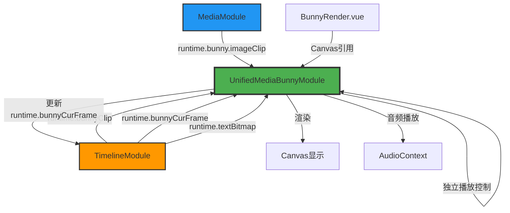

# Bunny 系统完整设计与迁移方案

## 📋 目录

1. [概述](#概述)
2. [完全独立的 Bunny 系统设计](#完全独立的-bunny-系统设计)
3. [WebAV 到 Bunny 组件迁移方案](#webav-到-bunny-组件迁移方案)
4. [相关文档](#相关文档)

---

## 概述

本文档整合了 Bunny 系统的完整设计方案和从 WebAV 到 Bunny 的迁移指南。包含：

- **系统设计**：完全独立的 MediaBunny 播放和渲染系统架构
- **迁移方案**：从现有 WebAV 系统平滑过渡到 Bunny 系统的详细步骤

---

# 完全独立的 Bunny 系统设计

## 1. 设计概述

完全使用 MediaBunny 替代 WebAV，创建一个独立的播放和渲染系统。UnifiedMediaBunnyModule 将拥有自己的播放控制逻辑，不依赖现有的 PlaybackModule（因为 PlaybackModule 与 WebAV 紧密耦合）。

## 2. 核心设计原则

### 2.1 完全独立
- ❌ **不依赖** UnifiedPlaybackModule
- ❌ **不依赖** UnifiedWebavModule
- ✅ **独立管理**播放状态和时间控制
- ✅ **独立实现**渲染循环和音频调度

### 2.2 数据来源
- ✅ 从 [`UnifiedTimelineModule`](../LightCut-frontend/src/core/modules/UnifiedTimelineModule.ts) 获取 `runtime.bunnyClip`
- ✅ 直接更新 `TimelineItem.runtime.bunnyCurFrame`
- ✅ 从 [`MediaModule`](../LightCut-frontend/src/core/mediaitem/types.ts:50) 获取 `runtime.bunny.imageClip`
- ✅ 从 `TimelineItem.runtime.textBitmap` 获取文本渲染数据

### 2.3 Canvas 管理
- ✅ 通过 [`BunnyRender.vue`](../LightCut-frontend/src/components/panels/BunnyRender.vue) 传入 Canvas 引用
- ✅ 模块负责渲染循环和绘制

## 3. 架构设计

### 3.1 模块结构

```typescript
function createUnifiedMediaBunnyModule(registry: ModuleRegistry) {
  // ==================== 独立状态定义 ====================
  
  // 播放控制状态（完全独立）
  const isPlaying: Ref<boolean>
  const currentFrame: Ref<number>
  const currentTime: Ref<number>
  const duration: Ref<number>
  const durationN: Ref<bigint>
  const playbackRate: Ref<number>
  
  // 模块状态
  const isMediaBunnyReady: Ref<boolean>
  const mediaBunnyError: Ref<string | null>
  
  // Canvas 引用
  const canvas: Ref<HTMLCanvasElement | null>
  const ctx: Ref<CanvasRenderingContext2D | null>
  
  // Audio Context
  const audioContext: Ref<AudioContext | null>
  const gainNode: Ref<GainNode | null>
  
  // ==================== 核心方法 ====================
  
  // Canvas 管理
  function setCanvas(canvasElement: HTMLCanvasElement): void
  function clearCanvas(): void
  
  // 渲染循环
  function startRenderLoop(): void
  function stopRenderLoop(): void
  
  // 独立的播放控制
  function play(): Promise<void>
  function pause(): void
  function stop(): void
  function togglePlayPause(): void
  function seekToFrame(frame: number): Promise<void>
  function nextFrame(): void
  function previousFrame(): void
  
  // 时间控制
  function setCurrentFrame(frame: number): void
  function updateTimelineDuration(durationN: bigint): void
  
  // 数据获取和渲染
  function updateFrame(): Promise<void>
  function renderToCanvas(): void
  
  // 音频调度
  function scheduleAudioBuffers(samples: AudioSample[], rate: number): void
  function stopAllAudioNodes(): void
  
  // 导出功能（TODO）
  function exportVideo(config: ExportConfig): Promise<Uint8Array>
  function cancelExport(): void
  
  // 资源管理
  function dispose(): Promise<void>
  
  return {
    // 播放状态
    isPlaying,
    currentFrame,
    currentTime,
    duration,
    durationN,
    playbackRate,
    
    // 模块状态
    isMediaBunnyReady,
    mediaBunnyError,
    
    // 方法
    setCanvas,
    clearCanvas,
    play,
    pause,
    stop,
    togglePlayPause,
    seekToFrame,
    nextFrame,
    previousFrame,
    setCurrentFrame,
    updateTimelineDuration,
    exportVideo,
    cancelExport,
    dispose,
  }
}
```

### 3.2 与原始 AVCanvas 的对比

| 特性 | 原始 AVCanvas | UnifiedMediaBunnyModule |
|------|--------------|------------------------|
| 播放控制 | 内部实现 | 内部实现（独立） |
| 时间管理 | 内部管理 | 内部管理（独立） |
| Canvas 管理 | 内部管理 | 外部传入 |
| 数据来源 | setClips() | 从 TimelineModule 获取 |
| 状态管理 | 类成员变量 | Vue ref 响应式 |
| 模块化 | 单一类 | 函数式模块 |
| 依赖注入 | 无 | ModuleRegistry |

## 4. 核心功能实现

### 4.1 独立的播放状态管理

```typescript
// 独立的播放控制状态（不使用 playbackState 聚合对象）
const isPlaying = ref(false)
const currentFrame = ref(0)
const currentTime = ref(0)
const duration = ref(0)
const durationN = ref(0n)
const playbackRate = ref(1)

// 模块就绪状态
const isMediaBunnyReady = ref(false)
const mediaBunnyError = ref<string | null>(null)

// Canvas 引用
const canvas = ref<HTMLCanvasElement | null>(null)
const ctx = ref<CanvasRenderingContext2D | null>(null)

// Audio Context
const audioContext = ref<AudioContext | null>(null)
const gainNode = ref<GainNode | null>(null)

// 音频节点管理
const queuedAudioNodes = new Set<AudioBufferSourceNode>()

// 渲染循环相关
let renderLoopCleanup: (() => void) | null = null
let renderStart = 0
let renderRunCnt = 0
const expectFrameTime = 1000 / RENDERER_FPS

// 时间同步锚点（类似原始 AVCanvas）
let audioContextStartTime: number | null = null
let playbackTimeAtStart = 0
```

### 4.2 Canvas 设置

```typescript
/**
 * 设置 Canvas 元素
 * 由 BunnyRender.vue 调用
 */
function setCanvas(canvasElement: HTMLCanvasElement): void {
  console.log('🎨 [UnifiedMediaBunnyModule] 设置 Canvas')
  
  canvas.value = canvasElement
  ctx.value = canvasElement.getContext('2d')
  
  if (!ctx.value) {
    const error = '无法获取 Canvas 2D 上下文'
    console.error(`❌ [UnifiedMediaBunnyModule] ${error}`)
    mediaBunnyError.value = error
    return
  }
  
  // 初始化 Audio Context
  if (!audioContext.value) {
    audioContext.value = new AudioContext({
      sampleRate: AUDIO_DEFAULT_SAMPLE_RATE,
    })
    gainNode.value = audioContext.value.createGain()
    gainNode.value.connect(audioContext.value.destination)
    console.log(`🎧 [UnifiedMediaBunnyModule] AudioContext 已创建`)
  }
  
  // 启动渲染循环
  startRenderLoop()
  
  isMediaBunnyReady.value = true
  mediaBunnyError.value = null
  
  console.log('✅ [UnifiedMediaBunnyModule] Canvas 设置完成')
}

/**
 * 清空 Canvas
 */
function clearCanvas(): void {
  if (canvas.value && ctx.value) {
    ctx.value.clearRect(0, 0, canvas.value.width, canvas.value.height)
  }
}
```

### 4.3 渲染循环管理

```typescript
/**
 * 启动渲染循环
 */
function startRenderLoop(): void {
  if (renderLoopCleanup) {
    console.warn('⚠️ [UnifiedMediaBunnyModule] 渲染循环已在运行')
    return
  }
  
  renderStart = performance.now()
  renderRunCnt = 0
  
  renderLoopCleanup = workerTimer(() => {
    // 时间修正逻辑（与原始 AVCanvas 一致）
    if ((performance.now() - renderStart) / (expectFrameTime * renderRunCnt) < 1) {
      return
    }
    
    // 更新播放状态并获取当前帧
    updateFrame()
    
    // 渲染到 Canvas
    renderToCanvas()
    
    renderRunCnt++
  }, expectFrameTime)
  
  console.log('🎬 [UnifiedMediaBunnyModule] 渲染循环已启动')
}

/**
 * 停止渲染循环
 */
function stopRenderLoop(): void {
  if (renderLoopCleanup) {
    renderLoopCleanup()
    renderLoopCleanup = null
    console.log('🛑 [UnifiedMediaBunnyModule] 渲染循环已停止')
  }
}
```

### 4.4 独立的播放控制

```typescript
/**
 * 获取当前播放时间
 * 使用 AudioContext 时钟作为基准（与原始 AVCanvas 一致）
 */
function getCurrentPlaybackTime(): number {
  if (!isPlaying.value || !audioContext.value || audioContextStartTime === null) {
    return playbackTimeAtStart
  }
  
  return audioContext.value.currentTime - audioContextStartTime + playbackTimeAtStart
}

/**
 * 开始播放
 */
async function play(): Promise<void> {
  console.log('▶️ [UnifiedMediaBunnyModule] 开始播放')
  
  // 恢复 AudioContext
  if (audioContext.value && audioContext.value.state === 'suspended') {
    await audioContext.value.resume()
    console.log('🎧 [UnifiedMediaBunnyModule] AudioContext 已恢复')
  }
  
  // 记录播放开始时的时间锚点
  if (audioContext.value) {
    audioContextStartTime = audioContext.value.currentTime
  }
  
  isPlaying.value = true
  
  console.log('✅ [UnifiedMediaBunnyModule] 播放已开始')
}

/**
 * 暂停播放
 */
function pause(): void {
  console.log('⏸️ [UnifiedMediaBunnyModule] 暂停播放')
  
  // 保存当前播放时间
  const currentTimeN = BigInt(Math.floor(getCurrentPlaybackTime() * RENDERER_FPS))
  playbackTimeAtStart = Number(currentTimeN) / RENDERER_FPS
  
  isPlaying.value = false
  
  // 停止所有音频
  stopAllAudioNodes()
  
  console.log('✅ [UnifiedMediaBunnyModule] 播放已暂停')
}

/**
 * 停止播放并回到开始
 */
function stop(): void {
  console.log('⏹️ [UnifiedMediaBunnyModule] 停止播放')
  
  pause()
  seekToFrame(0)
  
  console.log('✅ [UnifiedMediaBunnyModule] 播放已停止')
}

/**
 * 切换播放/暂停状态
 */
function togglePlayPause(): void {
  if (isPlaying.value) {
    pause()
  } else {
    play()
  }
}

/**
 * 跳转到指定帧数
 * Seek 操作会自动暂停播放
 */
async function seekToFrame(frame: number): Promise<void> {
  console.log(`⏩ [UnifiedMediaBunnyModule] Seek 到: ${frame}帧`)
  
  // Seek 时必须暂停播放
  if (isPlaying.value) {
    isPlaying.value = false
  }
  
  // 停止所有音频
  stopAllAudioNodes()
  
  // 限制在有效范围内
  const clampedFrame = Math.max(0, Math.min(frame, Number(durationN.value)))
  
  // 更新播放时间锚点
  playbackTimeAtStart = clampedFrame / RENDERER_FPS
  currentFrame.value = clampedFrame
  currentTime.value = playbackTimeAtStart
  
  console.log(`✅ [UnifiedMediaBunnyModule] Seek 完成，播放已暂停`)
}

/**
 * 下一帧
 */
function nextFrame(): void {
  const newFrame = currentFrame.value + 1
  seekToFrame(newFrame)
}

/**
 * 上一帧
 */
function previousFrame(): void {
  const newFrame = currentFrame.value - 1
  seekToFrame(newFrame)
}

/**
 * 设置当前帧数
 */
function setCurrentFrame(frame: number): void {
  const clampedFrame = Math.max(0, Math.min(frame, Number(durationN.value)))
  currentFrame.value = clampedFrame
  currentTime.value = clampedFrame / RENDERER_FPS
}

/**
 * 更新时间轴时长
 */
function updateTimelineDuration(newDurationN: bigint): void {
  durationN.value = newDurationN
  duration.value = Number(newDurationN) / RENDERER_FPS
  
  console.log(`🎯 [UnifiedMediaBunnyModule] 更新时长: ${duration.value.toFixed(2)}s (${newDurationN}帧)`)
}
```

### 4.5 数据获取和帧更新

```typescript
/**
 * 更新帧数据
 * 在渲染循环中调用
 */
async function updateFrame(): Promise<void> {
  if (!isPlaying.value) return
  
  const timelineModule = registry.get<UnifiedTimelineModule>(MODULE_NAMES.TIMELINE)
  
  // 使用 AudioContext 时钟计算当前播放时间
  const currentPlaybackTime = getCurrentPlaybackTime()
  const currentTimeN = BigInt(Math.floor(currentPlaybackTime * RENDERER_FPS))
  
  // 更新播放状态
  setCurrentFrame(Number(currentTimeN))
  
  // 检查是否播放结束
  if (currentTimeN >= durationN.value) {
    pause()
    console.log('✅ [UnifiedMediaBunnyModule] 播放结束')
    return
  }
  
  // 遍历所有时间轴项目，更新其 runtime 数据
  await Promise.all(
    timelineModule.timelineItems.value.map(async (item) => {
      // 只处理就绪状态的项目
      if (item.timelineStatus !== 'ready') return
      
      // 获取 bunnyClip
      const clip = item.runtime.bunnyClip
      if (!clip) return
      
      try {
        const { audio, video, state } = await clip.tickN(currentTimeN)
        
        if (state === 'success') {
          // 更新 runtime.bunnyCurFrame（视频帧）
          if (video) {
            // 先关闭旧帧
            item.runtime.bunnyCurFrame?.close()
            item.runtime.bunnyCurFrame = video
          }
          
          // 调度音频播放
          if (audio.length > 0 && audioContext.value && gainNode.value) {
            scheduleAudioBuffers(audio, clip.getPlaybackRate())
          }
        } else {
          // 超出范围，清理帧
          item.runtime.bunnyCurFrame?.close()
          item.runtime.bunnyCurFrame = undefined
        }
      } catch (error) {
        console.error(`❌ [UnifiedMediaBunnyModule] 更新帧失败: ${item.id}`, error)
      }
    })
  )
}
```

### 4.6 网格布局渲染

```typescript
/**
 * 渲染到 Canvas
 * 使用网格布局渲染所有可视内容
 */
function renderToCanvas(): void {
  if (!canvas.value || !ctx.value) return
  
  const timelineModule = registry.get<UnifiedTimelineModule>(MODULE_NAMES.TIMELINE)
  const mediaModule = registry.get<UnifiedMediaModule>(MODULE_NAMES.MEDIA)
  
  // 清空画布
  ctx.value.clearRect(0, 0, canvas.value.width, canvas.value.height)
  
  // 收集所有可渲染的内容
  const renderableItems: Array<{
    type: 'video' | 'image' | 'text'
    source: VideoFrame | ImageBitmap
  }> = []
  
  for (const item of timelineModule.timelineItems.value) {
    if (item.timelineStatus !== 'ready') continue
    
    if (item.mediaType === 'video' && item.runtime.bunnyCurFrame) {
      // 视频帧
      const frame = item.runtime.bunnyCurFrame.toVideoFrame()
      renderableItems.push({ type: 'video', source: frame })
    } else if (item.mediaType === 'image') {
      // 图片
      const mediaItem = mediaModule.getMediaItem(item.mediaItemId)
      if (mediaItem?.runtime.bunny?.imageClip) {
        renderableItems.push({ type: 'image', source: mediaItem.runtime.bunny.imageClip })
      }
    } else if (item.mediaType === 'text' && item.runtime.textBitmap) {
      // 文本
      renderableItems.push({ type: 'text', source: item.runtime.textBitmap })
    }
  }
  
  // 如果没有可渲染内容，直接返回
  if (renderableItems.length === 0) return
  
  // 计算网格布局（尽量接近正方形）
  const cols = Math.ceil(Math.sqrt(renderableItems.length))
  const rows = Math.ceil(renderableItems.length / cols)
  
  // 计算每个单元格的宽高
  const cellWidth = canvas.value.width / cols
  const cellHeight = canvas.value.height / rows
  
  // 绘制所有内容到网格
  renderableItems.forEach((item, index) => {
    const col = index % cols
    const row = Math.floor(index / cols)
    const x = col * cellWidth
    const y = row * cellHeight
    
    ctx.value!.drawImage(item.source, x, y, cellWidth, cellHeight)
    
    // 关闭 VideoFrame（ImageBitmap 不需要关闭）
    if (item.type === 'video') {
      ;(item.source as VideoFrame).close()
    }
  })
}
```

### 4.7 音频调度

```typescript
/**
 * 调度音频缓冲进行播放
 */
function scheduleAudioBuffers(audioSamples: AudioSample[], rate: number): void {
  if (!audioContext.value || !gainNode.value) return
  
  for (const sample of audioSamples) {
    const node = audioContext.value.createBufferSource()
    node.buffer = sample.toAudioBuffer()
    node.playbackRate.value = rate
    node.connect(gainNode.value)
    
    // 计算在 AudioContext 时间轴上的开始时间
    const startTimestamp =
      audioContextStartTime! + sample.timestamp - playbackTimeAtStart
    
    // 处理未来和过去的音频
    const curTime = audioContext.value.currentTime
    if (startTimestamp >= curTime) {
      // 未来的音频：精确调度
      node.start(startTimestamp)
    } else {
      // 过去的音频：使用 offset 播放剩余部分
      const offset = curTime - startTimestamp
      node.start(curTime, offset)
    }
    
    // 记录已调度
    queuedAudioNodes.add(node)
    
    // 节点结束时清理
    node.onended = () => {
      queuedAudioNodes.delete(node)
    }
    
    sample.close()
  }
}

/**
 * 停止所有音频节点
 */
function stopAllAudioNodes(): void {
  for (const node of queuedAudioNodes) {
    try {
      node.stop()
    } catch (err) {
      // 忽略已停止的节点
    }
  }
  queuedAudioNodes.clear()
}
```

### 4.8 资源清理

```typescript
/**
 * 释放所有资源
 */
async function dispose(): Promise<void> {
  console.log('🧹 [UnifiedMediaBunnyModule] 清理资源')
  
  // 停止渲染循环
  stopRenderLoop()
  
  // 停止播放
  pause()
  
  // 清空 Canvas
  clearCanvas()
  
  // 关闭 AudioContext
  if (audioContext.value) {
    await audioContext.value.close()
  }
  
  // 清理时间轴项目中的帧缓存
  const timelineModule = registry.get<UnifiedTimelineModule>(MODULE_NAMES.TIMELINE)
  for (const item of timelineModule.timelineItems.value) {
    item.runtime.bunnyCurFrame?.close()
    item.runtime.bunnyCurFrame = undefined
  }
  
  // 重置状态
  canvas.value = null
  ctx.value = null
  audioContext.value = null
  gainNode.value = null
  isMediaBunnyReady.value = false
  currentFrame.value = 0
  currentTime.value = 0
  isPlaying.value = false
  
  console.log('✅ [UnifiedMediaBunnyModule] 资源清理完成')
}
```

### 4.9 导出功能（TODO）

```typescript
/**
 * 导出视频
 */
async function exportVideo(config: ExportConfig): Promise<Uint8Array> {
  throw new Error('导出功能暂未实现')
}

/**
 * 取消导出
 */
function cancelExport(): void {
  console.warn('⚠️ [UnifiedMediaBunnyModule] 导出功能暂未实现')
}
```

## 5. 集成步骤

### 5.1 在 ModuleRegistry 中注册

```typescript
// LightCut-frontend/src/core/modules/ModuleRegistry.ts

export const MODULE_NAMES = {
  // ... 现有模块
  MEDIABUNNY: 'mediabunny',
} as const

export type ModuleMap = {
  // ... 现有模块
  [MODULE_NAMES.MEDIABUNNY]: UnifiedMediaBunnyModule
}
```

### 5.2 在 unifiedStore 中集成

```typescript
// LightCut-frontend/src/core/unifiedStore.ts

import { createUnifiedMediaBunnyModule } from './modules/UnifiedMediaBunnyModule'

export function createUnifiedStore() {
  // ... 创建其他模块
  
  const mediaBunnyModule = createUnifiedMediaBunnyModule(registry)
  registry.register(MODULE_NAMES.MEDIABUNNY, mediaBunnyModule)
  
  return {
    // ... 其他模块
    ...mediaBunnyModule,
  }
}
```

### 5.3 在 BunnyRender.vue 中使用

```vue
<script setup lang="ts">
import { ref, onMounted, onUnmounted, computed } from 'vue'
import { useUnifiedStore } from '@/core/unifiedStore'

const unifiedStore = useUnifiedStore()
const canvasRef = ref<HTMLCanvasElement>()

// 计算属性
const canvasWidth = computed(() => unifiedStore.videoResolution.width)
const canvasHeight = computed(() => unifiedStore.videoResolution.height)

onMounted(() => {
  if (canvasRef.value) {
    // 将 canvas 传递给模块
    unifiedStore.setCanvas(canvasRef.value)
  }
})

onUnmounted(() => {
  // 清理资源
  unifiedStore.dispose()
})
</script>

<template>
  <div class="bunny-renderer">
    <canvas 
      ref="canvasRef" 
      :width="canvasWidth" 
      :height="canvasHeight" 
      class="bunny-canvas" 
    />
    
    <!-- 播放控制 -->
    <div class="playback-controls">
      <button @click="unifiedStore.togglePlayPause()">
        {{ unifiedStore.isPlaying ? '暂停' : '播放' }}
      </button>
      <button @click="unifiedStore.stop()">停止</button>
      <button @click="unifiedStore.previousFrame()">上一帧</button>
      <button @click="unifiedStore.nextFrame()">下一帧</button>
      <span>{{ unifiedStore.currentTime.toFixed(2) }}s / {{ unifiedStore.duration.toFixed(2) }}s</span>
    </div>
  </div>
</template>
```

## 6. 数据流向图



## 7. 关键差异对比

| 特性 | WebAV + PlaybackModule | 独立 Bunny 系统 |
|------|----------------------|----------------|
| 播放控制 | PlaybackModule 管理 | MediaBunnyModule 独立管理 |
| 时间同步 | WebAV timeupdate 事件 | AudioContext 时钟 |
| 状态管理 | 分散在多个模块 | 集中在 MediaBunnyModule |
| Canvas 管理 | WebAV 内部管理 | 外部传入 |
| 数据来源 | WebAV Sprite | TimelineModule runtime |
| 渲染方式 | WebAV 合成 | 网格布局 |
| 音频播放 | WebAV 管理 | 独立 AudioContext |
| 依赖关系 | 强耦合 | 完全独立 |

## 8. 优势

1. **完全独立**：不依赖 WebAV 和 PlaybackModule，系统更简洁
2. **统一控制**：所有播放逻辑集中在一个模块，易于维护
3. **响应式状态**：使用 Vue ref，便于 UI 绑定
4. **灵活渲染**：支持视频、图片、文本混合渲染
5. **精确同步**：使用 AudioContext 时钟确保音画同步
6. **资源复用**：直接使用 TimelineModule 的 runtime 数据
7. **易于扩展**：模块化设计便于后续功能扩展

## 9. 注意事项

1. **性能优化**：实时获取数据可能有性能开销，需要监控
2. **错误处理**：需要完善的错误处理机制
3. **资源清理**：确保所有 VideoSample 和 AudioSample 正确关闭
4. **时间精度**：使用 AudioContext 时钟确保精确同步
5. **Canvas 生命周期**：确保 Canvas 在组件卸载时正确清理

## 10. 后续扩展

1. **多轨道渲染**：支持多个视频轨道的合成渲染
2. **特效支持**：集成滤镜和特效处理
3. **性能监控**：添加渲染性能指标监控
4. **缓存优化**：对频繁访问的数据进行缓存
5. **WebGL 渲染**：考虑使用 WebGL 提升渲染性能
6. **导出功能**：实现完整的视频导出功能

---

# WebAV 到 Bunny 组件迁移方案

## 📋 迁移概述

本部分详细说明如何将现有的 WebAV 播放系统迁移到完全独立的 Bunny 系统。

## 🎯 迁移目标

1. **完全替换 WebAV**：使用 MediaBunny 作为唯一的播放引擎
2. **保持接口兼容**：尽量保持 `unifiedStore` 的 API 不变，减少组件修改
3. **独立播放控制**：Bunny 系统拥有自己的播放状态管理
4. **渐进式迁移**：支持逐步切换，可以先保留 WebAV 作为备选

---

## 📊 依赖分析结果

### 1. 直接使用 WebAV 方法的组件

#### [`UnifiedPlaybackControls.vue`](../LightCut-frontend/src/components/timeline/UnifiedPlaybackControls.vue)

**当前使用的 WebAV 方法：**
- `unifiedStore.webAVPlay()` - 播放
- `unifiedStore.webAVPause()` - 暂停
- `unifiedStore.webAVSeekTo(0)` - 跳转到开始

**迁移策略：**
```typescript
// ❌ 旧代码（WebAV）
unifiedStore.webAVPlay()
unifiedStore.webAVPause()
unifiedStore.webAVSeekTo(0)

// ✅ 新代码（Bunny）
unifiedStore.bunnyPlay()
unifiedStore.bunnyPause()
unifiedStore.bunnySeekToFrame(0)
```

**修改位置：**
- 第 58 行：`togglePlayPause()` 函数
- 第 72 行：`stop()` 函数

---

### 2. 使用播放状态的组件

以下组件通过 `unifiedStore` 访问播放状态，**无需修改**（因为 Bunny 会更新相同的状态）：

#### [`UnifiedTimeline.vue`](../LightCut-frontend/src/components/timeline/UnifiedTimeline.vue)
- 使用：`unifiedStore.currentFrame`
- 影响：无需修改，Bunny 会更新此状态

#### [`UnifiedPlayhead.vue`](../LightCut-frontend/src/components/timeline/UnifiedPlayhead.vue)
- 使用：`unifiedStore.currentFrame`、`unifiedStore.pause()`
- 影响：`pause()` 需要改为 `bunnyPause()`

#### [`UnifiedClipManagementToolbar.vue`](../LightCut-frontend/src/components/timeline/UnifiedClipManagementToolbar.vue)
- 使用：`unifiedStore.currentFrame`、`unifiedStore.isPlaying`、`unifiedStore.playbackRate`
- 影响：无需修改（只读状态）

#### [`WebAVRenderer.vue`](../LightCut-frontend/src/components/panels/WebAVRenderer.vue)
- 使用：`unifiedStore.isPlaying`
- 影响：可能需要重命名或废弃此组件

#### [`UnifiedPropertiesPanel.vue`](../LightCut-frontend/src/components/panels/UnifiedPropertiesPanel.vue)
- 使用：`unifiedStore.currentFrame`
- 影响：无需修改

#### [`PreviewWindow.vue`](../LightCut-frontend/src/components/panels/PreviewWindow.vue)
- 使用：`unifiedStore.currentFrame`
- 影响：无需修改

---

## 🔄 unifiedStore 接口变更

### 当前 WebAV 接口（需要替换）

```typescript
// WebAV 状态
avCanvas: Ref<AVCanvas | null>
isWebAVReady: Ref<boolean>
webAVError: Ref<string | null>

// WebAV 播放控制
webAVPlay(): Promise<void>
webAVPause(): void
webAVSeekTo(microseconds: number): Promise<void>

// WebAV 管理
setAVCanvas(canvas: AVCanvas | null): void
destroyWebAV(): void
```

### 新增 Bunny 接口

```typescript
// Bunny 状态
isMediaBunnyReady: Ref<boolean>
mediaBunnyError: Ref<string | null>

// Bunny 播放控制（完全独立）
bunnyPlay(): Promise<void>
bunnyPause(): void
bunnyStop(): void
bunnyTogglePlayPause(): Promise<void>
bunnySeekToFrame(frame: number): Promise<void>
bunnyNextFrame(): Promise<void>
bunnyPreviousFrame(): Promise<void>

// Bunny Canvas 管理
setBunnyCanvas(canvas: HTMLCanvasElement): void

// Bunny 时长管理
updateBunnyTimelineDuration(durationN: bigint): void

// Bunny 清理
disposeBunny(): void
```

### 共享的播放状态（保持不变）

```typescript
// 这些状态由 Bunny 更新，组件无需修改
currentFrame: Ref<number>
currentTime: Ref<number>
isPlaying: Ref<boolean>
playbackRate: Ref<number>
duration: Ref<number>
durationN: Ref<bigint>
```

---

## 📝 详细迁移步骤

### 阶段 1：创建 Bunny 模块（不影响现有功能）

1. ✅ 创建 [`UnifiedMediaBunnyModule.ts`](../LightCut-frontend/src/core/modules/UnifiedMediaBunnyModule.ts)
2. ✅ 在 [`unifiedStore.ts`](../LightCut-frontend/src/core/unifiedStore.ts) 中注册模块
3. ✅ 导出 Bunny 相关方法（以 `bunny` 前缀命名）

**此阶段不影响现有功能，WebAV 继续工作**

---

### 阶段 2：集成 Bunny 到 BunnyRender.vue

修改 [`BunnyRender.vue`](../LightCut-frontend/src/components/panels/BunnyRender.vue)：

```vue
<script setup lang="ts">
import { ref, onMounted, onUnmounted } from 'vue'
import { useUnifiedStore } from '@/core/unifiedStore'

const unifiedStore = useUnifiedStore()
const canvasRef = ref<HTMLCanvasElement | null>(null)

onMounted(() => {
  if (canvasRef.value) {
    // 设置 Bunny Canvas
    unifiedStore.setBunnyCanvas(canvasRef.value)
  }
})

onUnmounted(() => {
  // 清理 Bunny 资源
  unifiedStore.disposeBunny()
})
</script>

<template>
  <div class="bunny-render-container">
    <canvas ref="canvasRef" class="bunny-canvas"></canvas>
  </div>
</template>
```

**此阶段 Bunny 开始渲染，但播放控制仍使用 WebAV**

---

### 阶段 3：切换播放控制到 Bunny

#### 3.1 修改 [`UnifiedPlaybackControls.vue`](../LightCut-frontend/src/components/timeline/UnifiedPlaybackControls.vue)

```typescript
// 修改前（第 53-66 行）
function togglePlayPause() {
  safePlaybackOperation(
    () => {
      if (isPlaying.value) {
        unifiedStore.webAVPause()  // ❌ 旧代码
      } else {
        unifiedStore.webAVPlay()   // ❌ 旧代码
      }
    },
    t('common.play') + '/' + t('common.pause') + t('common.toggle'),
  )
}

// 修改后
function togglePlayPause() {
  safePlaybackOperation(
    () => {
      if (isPlaying.value) {
        unifiedStore.bunnyPause()  // ✅ 新代码
      } else {
        unifiedStore.bunnyPlay()   // ✅ 新代码
      }
    },
    t('common.play') + '/' + t('common.pause') + t('common.toggle'),
  )
}
```

```typescript
// 修改前（第 68-78 行）
function stop() {
  safePlaybackOperation(
    () => {
      unifiedStore.webAVPause()    // ❌ 旧代码
      unifiedStore.webAVSeekTo(0)  // ❌ 旧代码
    },
    t('common.stop') + t('common.playback'),
  )
}

// 修改后
function stop() {
  safePlaybackOperation(
    () => {
      unifiedStore.bunnyStop()  // ✅ 新代码（内部会暂停并跳转到 0）
    },
    t('common.stop') + t('common.playback'),
  )
}
```

#### 3.2 修改 [`UnifiedPlayhead.vue`](../LightCut-frontend/src/components/timeline/UnifiedPlayhead.vue)

```typescript
// 修改前（第 60-61 行）
// 暂停WebAV播放
unifiedStore.pause()  // ❌ 这个方法可能调用 WebAV

// 修改后
// 暂停Bunny播放
unifiedStore.bunnyPause()  // ✅ 新代码
```

**此阶段完全切换到 Bunny 播放控制**

---

### 阶段 4：清理 WebAV 相关代码（可选）

如果确认 Bunny 工作正常，可以：

1. 移除 [`UnifiedWebavModule.ts`](../LightCut-frontend/src/core/modules/UnifiedWebavModule.ts)
2. 移除 [`UnifiedPlaybackModule.ts`](../LightCut-frontend/src/core/modules/UnifiedPlaybackModule.ts)（如果不再需要）
3. 从 [`unifiedStore.ts`](../LightCut-frontend/src/core/unifiedStore.ts) 中移除 WebAV 相关导出
4. 重命名或移除 [`WebAVRenderer.vue`](../LightCut-frontend/src/components/panels/WebAVRenderer.vue)

---

## 🔍 需要修改的文件清单

### 核心模块文件

| 文件 | 操作 | 优先级 |
|------|------|--------|
| [`LightCut-frontend/src/core/modules/UnifiedMediaBunnyModule.ts`](../LightCut-frontend/src/core/modules/UnifiedMediaBunnyModule.ts) | 创建 | 🔴 高 |
| [`LightCut-frontend/src/core/modules/ModuleRegistry.ts`](../LightCut-frontend/src/core/modules/ModuleRegistry.ts) | 添加 `MEDIABUNNY` 常量 | 🔴 高 |
| [`LightCut-frontend/src/core/unifiedStore.ts`](../LightCut-frontend/src/core/unifiedStore.ts) | 注册模块并导出方法 | 🔴 高 |

### Vue 组件文件

| 文件 | 修改内容 | 优先级 |
|------|----------|--------|
| [`LightCut-frontend/src/components/panels/BunnyRender.vue`](../LightCut-frontend/src/components/panels/BunnyRender.vue) | 集成 Bunny Canvas | 🔴 高 |
| [`LightCut-frontend/src/components/timeline/UnifiedPlaybackControls.vue`](../LightCut-frontend/src/components/timeline/UnifiedPlaybackControls.vue) | 替换 WebAV 方法调用 | 🟡 中 |
| [`LightCut-frontend/src/components/timeline/UnifiedPlayhead.vue`](../LightCut-frontend/src/components/timeline/UnifiedPlayhead.vue) | 替换 `pause()` 调用 | 🟡 中 |
| [`LightCut-frontend/src/components/panels/WebAVRenderer.vue`](../LightCut-frontend/src/components/panels/WebAVRenderer.vue) | 可能需要重命名/废弃 | 🟢 低 |

### 无需修改的组件

以下组件只读取播放状态，**无需修改**：
- [`UnifiedTimeline.vue`](../LightCut-frontend/src/components/timeline/UnifiedTimeline.vue)
- [`UnifiedClipManagementToolbar.vue`](../LightCut-frontend/src/components/timeline/UnifiedClipManagementToolbar.vue)
- [`UnifiedPropertiesPanel.vue`](../LightCut-frontend/src/components/panels/UnifiedPropertiesPanel.vue)
- [`PreviewWindow.vue`](../LightCut-frontend/src/components/panels/PreviewWindow.vue)

---

## ⚠️ 注意事项

### 1. 播放状态同步

Bunny 系统会直接更新 `unifiedStore` 中的播放状态：
```typescript
// Bunny 内部会更新这些状态
unifiedStore.currentFrame.value = newFrame
unifiedStore.isPlaying.value = true/false
unifiedStore.currentTime.value = newTime
```

所有读取这些状态的组件会自动响应，无需修改。

### 2. 时间单位差异

- **WebAV**：使用微秒（microseconds）
- **Bunny**：使用帧数（frames）

迁移时需要注意单位转换：
```typescript
// WebAV
webAVSeekTo(microseconds)

// Bunny
bunnySeekToFrame(frames)
```

### 3. 播放速率

Bunny 系统会读取 `unifiedStore.playbackRate`，但需要在 `setPlaybackRate()` 时通知 Bunny：

```typescript
// unifiedStore 中
function setPlaybackRate(rate: number) {
  playbackRate.value = rate
  // 通知 Bunny 更新播放速率
  mediaBunnyModule.updatePlaybackRate(rate)
}
```

### 4. 错误处理

Bunny 系统有独立的错误状态：
```typescript
unifiedStore.mediaBunnyError  // Bunny 错误信息
```

需要在 UI 中显示此错误状态。

---

## 🧪 测试计划

### 单元测试

1. ✅ Bunny 模块创建和初始化
2. ✅ Canvas 设置和渲染循环
3. ✅ 播放控制（play/pause/stop/seek）
4. ✅ 状态同步（currentFrame/isPlaying 等）
5. ✅ 音频调度和同步

### 集成测试

1. ✅ BunnyRender.vue 集成
2. ✅ UnifiedPlaybackControls.vue 播放控制
3. ✅ 多组件状态同步
4. ✅ 播放速率切换
5. ✅ Seek 操作

### 用户测试

1. ✅ 播放/暂停流畅性
2. ✅ 音画同步准确性
3. ✅ 拖动播放头响应
4. ✅ 多轨道渲染正确性
5. ✅ 性能表现

---

## 📈 迁移时间表

| 阶段 | 任务 | 状态 |
|------|------|------|
| 1 | 创建 Bunny 模块 | 已完成设计 |
| 2 | 集成到 BunnyRender.vue | 实施中 |
| 3 | 切换播放控制 | 待实施 |
| 4 | 测试和优化 | 待实施 |
| 5 | 清理 WebAV 代码 | 待实施 |

---

## 🎯 成功标准

1. ✅ Bunny 系统完全独立运行
2. ✅ 所有播放控制功能正常
3. ✅ 音画同步准确
4. ✅ 性能不低于 WebAV
5. ✅ 无 WebAV 依赖残留

---

## 📚 相关文档

- MediaBunny 官方文档
- WebAV API 参考
- Vue 3 Composition API 指南
- Web Audio API 文档