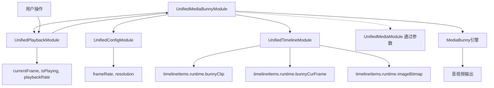

# AVCanvas 模块化重构设计方案

## 概述

本文档详细描述了将 `@/LightCut-frontend/src/core/mediabunny/av-canvas.ts` 重构为 `UnifiedMediaBunnyModule` 的完整设计方案。

## 🔄 重要设计更新

**基于用户反馈的关键架构调整**：

1. **移除冗余状态管理**：
   - ❌ 删除 `renderingState.currentFrames`
   - ❌ 删除 `activeClips` 数组
   - ✅ 直接使用 `timelineItems.runtime.bunnyCurFrame` 和 `timelineItems.runtime.bunnyClip`

2. **数据源统一**：
   - 渲染数据来源：`timelineItems.runtime.bunnyCurFrame` (VideoSample)
   - 文本渲染数据：`timelineItems.runtime.imageBitmap` (ImageBitmap)
   - Clip 实例来源：`timelineItems.runtime.bunnyClip` (BunnyClip)

3. **依赖关系调整**：
   - UnifiedMediaBunnyModule 直接依赖 UnifiedTimelineModule
   - 从 TimelineModule 获取所有渲染所需的数据
   - 避免重复的状态管理和数据同步

## 目标

- 将独立的 AVCanvas 类重构为符合 unified store 架构的模块
- 与现有的 UnifiedPlaybackModule 协同工作
- 保持功能完整性和性能优化
- 提供清晰的模块边界和职责分离

## 架构设计

### 1. 模块定位和职责

**UnifiedMediaBunnyModule 核心职责**：
- MediaBunny 播放引擎的状态管理和控制
- Canvas 和 AudioContext 生命周期管理
- 音视频渲染和同步处理
- IClip 实例的生命周期管理
- 作为 UnifiedPlaybackModule 的执行器

**不包含的职责**：
- ❌ 播放状态管理（属于 UnifiedPlaybackModule）
- ❌ 时间轴项目管理（属于 UnifiedTimelineModule）
- ❌ 媒体文件管理（属于 UnifiedMediaModule）
- ❌ 导出功能（暂不实现）

### 2. 状态架构设计

#### 2.1 响应式状态层

```typescript
// 引擎就绪状态
const isEngineReady = ref(false)
const engineError = ref<string | null>(null)

// Canvas 状态
const canvasState = ref({
  element: null as HTMLCanvasElement | null,
  context: null as CanvasRenderingContext2D | null,
  isInitialized: false,
  width: 0,
  height: 0,
})

// 渲染状态
const renderingState = ref({
  isRenderLoopActive: false,
  renderFPS: 0,
  frameCount: 0,
})

// 音频状态
const audioState = ref({
  isContextReady: false,
  sampleRate: AUDIO_DEFAULT_SAMPLE_RATE,
  activeNodesCount: 0,
})
```

#### 2.2 私有状态层

```typescript
// 核心实例（不需要响应式）
let avCanvasInstance: AVCanvas | null = null
let audioContextInstance: AudioContext | null = null
let gainNodeInstance: GainNode | null = null

// 渲染循环控制
let renderLoopCleanup: (() => void) | null = null
let renderStart: number = 0
let renderRunCnt: number = 0
let expectFrameTime: number = 1000 / RENDERER_FPS

// 音频管理
let queuedAudioNodes: Set<AudioBufferSourceNode> = new Set()
let audioContextStartTime: number | null = null
let playbackTimeAtStart: number = 0

// 渲染控制
let updating: boolean = false
```

### 3. 模块依赖设计

#### 3.1 依赖关系图



#### 3.2 状态同步策略

**单向依赖原则**：
- UnifiedMediaBunnyModule 监听 UnifiedPlaybackModule 的状态变化
- MediaBunny 引擎作为 PlaybackModule 状态的执行器
- 避免循环依赖和状态冲突

**状态监听机制**：
```typescript
// 监听播放状态变化
watch(playbackModule.isPlaying, async (isPlaying) => {
  if (!isEngineReady.value) return
  
  if (isPlaying) {
    await executePlay()
  } else {
    executePause()
  }
})

// 监听播放位置变化
watch(playbackModule.currentFrame, async (currentFrame) => {
  if (!isEngineReady.value || playbackModule.isPlaying.value) return
  
  await executeSeek(currentFrame)
})

// 监听播放速度变化
watch(playbackModule.playbackRate, (rate) => {
  if (!isEngineReady.value) return
  
  updatePlaybackRate(rate)
})
```

### 4. 接口设计

#### 4.1 状态管理接口

```typescript
// 状态查询（只读）
const isEngineAvailable: ComputedRef<boolean>
const engineSummary: ComputedRef<EngineStatus>
const canvasSummary: ComputedRef<CanvasStatus>
const audioSummary: ComputedRef<AudioStatus>

// 状态控制
function setEngineReady(ready: boolean): void
function setEngineError(error: string | null): void
function clearEngineState(): void
```

#### 4.2 Canvas 管理接口

```typescript
// Canvas 生命周期
function setCanvas(canvas: HTMLCanvasElement): void
function initializeEngine(): Promise<void>
function destroyEngine(): Promise<void>

// 渲染控制
function startRenderLoop(): void
function stopRenderLoop(): void
function updateRenderState(): void
```

#### 4.3 时间轴数据获取接口

```typescript
// 从 TimelineModule 获取数据
function getTimelineItems(): UnifiedTimelineItemData[]
function getBunnyClips(): BunnyClip[]
function getCurrentFrames(): (VideoSample | null)[]
function getImageBitmaps(): (ImageBitmap | null)[]
```

#### 4.4 资源管理接口

```typescript
// 资源清理
function dispose(): Promise<void>
function resetToDefaults(): void

// 内存管理
function cleanupAudioNodes(): void
function cleanupVideoFrames(): void

// 时间轴管理
function updateTimelineDuration(durationN: bigint): void
```

### 5. 内部实现策略

#### 5.1 播放控制的内部实现

```typescript
// 内部播放执行函数（不对外暴露）
async function executePlay(): Promise<void> {
  if (!avCanvasInstance || !isEngineReady.value) return
  
  try {
    const startFrame = playbackModule.currentFrame.value
    const playbackRate = playbackModule.playbackRate.value
    
    await avCanvasInstance.play({
      start: framesToMicroseconds(startFrame),
      playbackRate,
    })
  } catch (error) {
    setEngineError(`播放失败: ${error.message}`)
  }
}

function executePause(): void {
  if (!avCanvasInstance) return
  
  try {
    avCanvasInstance.pause()
  } catch (error) {
    setEngineError(`暂停失败: ${error.message}`)
  }
}

async function executeSeek(frame: number): Promise<void> {
  if (!avCanvasInstance) return
  
  try {
    const microseconds = framesToMicroseconds(frame)
    await avCanvasInstance.previewFrame(microseconds)
  } catch (error) {
    setEngineError(`跳转失败: ${error.message}`)
  }
}
```

#### 5.2 渲染循环实现

```typescript
function startRenderLoop(): void {
  if (renderLoopCleanup) {
    console.warn('⚠️ 渲染循环已在运行')
    return
  }

  renderStart = performance.now()
  renderRunCnt = 0
  renderingState.value.isRenderLoopActive = true

  renderLoopCleanup = workerTimer(() => {
    // 时间校正逻辑
    if ((performance.now() - renderStart) / (expectFrameTime * renderRunCnt) < 1) {
      return
    }

    updateRenderFrame()
    renderRunCnt++
    renderingState.value.frameCount = renderRunCnt
  }, expectFrameTime)
}

async function updateRenderFrame(): Promise<void> {
  if (updating || !playbackModule.isPlaying.value) return
  
  updating = true
  
  try {
    // 获取当前播放时间
    const currentFrame = playbackModule.currentFrame.value
    const currentTimeN = BigInt(currentFrame)
    
    // 从 TimelineModule 获取所有时间轴项目
    const timelineItems = timelineModule.timelineItems.value
    
    // 更新所有 BunnyClip 并收集音频数据
    const audioBuffersToSchedule: { buffers: AudioSample[], rate: number }[] = []
    
    await Promise.all(
      timelineItems.map(async (item) => {
        if (item.runtime.bunnyClip && item.timelineStatus === 'ready') {
          const { audio: newBuffers, video: frame, state } = await item.runtime.bunnyClip.tickN(currentTimeN)
          
          if (state === 'success') {
            // 更新当前帧数据到 runtime
            if (frame) {
              item.runtime.bunnyCurFrame?.close()
              item.runtime.bunnyCurFrame = frame
            }
            
            // 收集音频数据
            if (newBuffers.length > 0) {
              audioBuffersToSchedule.push({
                buffers: newBuffers,
                rate: item.runtime.bunnyClip.getPlaybackRate()
              })
            }
          } else {
            // 清理当前帧数据
            item.runtime.bunnyCurFrame?.close()
            item.runtime.bunnyCurFrame = undefined
          }
        }
      })
    )
    
    // 调度所有音频数据
    audioBuffersToSchedule.forEach(({ buffers, rate }) => {
      scheduleAudioBuffers(buffers, rate)
    })
    
    // 渲染到 Canvas
    renderToCanvas()
  } finally {
    updating = false
  }
}
```

#### 5.3 Canvas 渲染实现

```typescript
function renderToCanvas(): void {
  if (!canvasState.value.element || !canvasState.value.context) return

  const canvas = canvasState.value.element
  const ctx = canvasState.value.context
  
  // 清空画布
  ctx.clearRect(0, 0, canvas.width, canvas.height)

  // 从 TimelineModule 获取所有时间轴项目
  const timelineItems = timelineModule.timelineItems.value
  
  // 收集所有需要渲染的帧数据
  const framesToRender: Array<{
    frame: VideoSample | ImageBitmap
    index: number
  }> = []

  timelineItems.forEach((item, index) => {
    if (item.timelineStatus === 'ready') {
      // 视频帧渲染
      if (item.runtime.bunnyCurFrame) {
        framesToRender.push({
          frame: item.runtime.bunnyCurFrame,
          index
        })
      }
      // 文本/图片 ImageBitmap 渲染
      else if (item.runtime.imageBitmap) {
        framesToRender.push({
          frame: item.runtime.imageBitmap,
          index
        })
      }
    }
  })

  if (framesToRender.length === 0) return

  // 计算网格布局
  const cols = Math.ceil(Math.sqrt(framesToRender.length))
  const rows = Math.ceil(framesToRender.length / cols)
  const cellWidth = canvas.width / cols
  const cellHeight = canvas.height / rows

  // 渲染所有帧
  framesToRender.forEach(({ frame, index }) => {
    const col = index % cols
    const row = Math.floor(index / cols)
    const x = col * cellWidth
    const y = row * cellHeight

    if (frame instanceof VideoSample) {
      const videoFrame = frame.toVideoFrame()
      ctx.drawImage(videoFrame, x, y, cellWidth, cellHeight)
      videoFrame.close()
    } else if (frame instanceof ImageBitmap) {
      ctx.drawImage(frame, x, y, cellWidth, cellHeight)
    }
  })
}

function scheduleAudioBuffers(audioSamples: AudioSample[], rate: number): void {
  if (!audioContextInstance || !gainNodeInstance) return

  for (const sample of audioSamples) {
    const node = audioContextInstance.createBufferSource()
    node.buffer = sample.toAudioBuffer()
    node.playbackRate.value = rate
    node.connect(gainNodeInstance)

    const startTimestamp = audioContextStartTime! + sample.timestamp - playbackTimeAtStart
    const curTime = audioContextInstance.currentTime

    if (startTimestamp >= curTime) {
      node.start(startTimestamp)
    } else {
      const offset = curTime - startTimestamp
      node.start(curTime, offset)
    }

    queuedAudioNodes.add(node)
    
    node.onended = () => {
      queuedAudioNodes.delete(node)
      audioState.value.activeNodesCount = queuedAudioNodes.size
    }

    sample.close()
  }
  
  audioState.value.activeNodesCount = queuedAudioNodes.size
}

function stopAllAudioNodes(): void {
  for (const node of queuedAudioNodes) {
    try {
      node.stop()
    } catch (err) {
      // 节点可能已经停止，忽略错误
    }
  }
  queuedAudioNodes.clear()
  audioState.value.activeNodesCount = 0
}
```

### 6. 错误处理机制

#### 6.1 分层错误处理

```typescript
// 底层资源错误
function handleCanvasError(error: Error): void {
  setEngineError(`Canvas 错误: ${error.message}`)
  canvasState.value.isInitialized = false
}

function handleAudioContextError(error: Error): void {
  setEngineError(`音频上下文错误: ${error.message}`)
  audioState.value.isContextReady = false
}

// 业务逻辑错误
function handlePlaybackError(error: Error): void {
  setEngineError(`播放错误: ${error.message}`)
  // 通知 PlaybackModule 停止播放
  playbackModule.pause()
}

function handleRenderError(error: Error): void {
  console.error('渲染错误:', error)
  // 尝试恢复渲染循环
  stopRenderLoop()
  setTimeout(() => {
    if (isEngineReady.value) {
      startRenderLoop()
    }
  }, 1000)
}
```

#### 6.2 自动恢复策略

```typescript
// Canvas 重新初始化
async function recoverCanvas(): Promise<void> {
  try {
    if (canvasState.value.element) {
      await initializeEngine()
    }
  } catch (error) {
    console.error('Canvas 恢复失败:', error)
  }
}

// AudioContext 状态恢复
async function recoverAudioContext(): Promise<void> {
  try {
    if (audioContextInstance && audioContextInstance.state === 'suspended') {
      await audioContextInstance.resume()
      audioState.value.isContextReady = true
    }
  } catch (error) {
    console.error('AudioContext 恢复失败:', error)
  }
}
```

### 7. 性能优化策略

#### 7.1 渲染优化

- **智能帧跳过**：当渲染跟不上播放速度时自动跳帧
- **内存复用**：复用 VideoFrame 对象，避免频繁创建销毁
- **渲染节流**：限制渲染频率，避免过度渲染

#### 7.2 音频优化

- **音频节点池**：复用 AudioBufferSourceNode
- **智能调度**：根据播放状态动态调整音频缓冲
- **延迟补偿**：自动处理音频延迟问题

#### 7.3 内存管理

- **自动清理**：定期清理无用的音视频资源
- **内存监控**：监控内存使用情况，及时释放资源
- **错误恢复**：内存不足时自动降级处理

### 8. 模块集成

#### 8.1 ModuleRegistry 集成

```typescript
// 在 ModuleRegistry.ts 中添加
export const MODULE_NAMES = {
  // ... 现有模块
  MEDIABUNNY: 'mediabunny',
} as const

export type ModuleMap = {
  // ... 现有映射
  [MODULE_NAMES.MEDIABUNNY]: UnifiedMediaBunnyModule
}
```

#### 8.2 UnifiedStore 集成

```typescript
// 在 unifiedStore.ts 中集成
const unifiedMediaBunnyModule = createUnifiedMediaBunnyModule(registry)
registry.register(MODULE_NAMES.MEDIABUNNY, unifiedMediaBunnyModule)

// 导出接口
return {
  // ... 现有接口
  
  // MediaBunny 引擎状态（只读）
  isMediaBunnyReady: unifiedMediaBunnyModule.isEngineReady,
  mediaBunnyError: unifiedMediaBunnyModule.engineError,
  isMediaBunnyAvailable: unifiedMediaBunnyModule.isEngineAvailable,
  mediaBunnyEngineSummary: unifiedMediaBunnyModule.engineSummary,
  mediaBunnyCanvasState: unifiedMediaBunnyModule.canvasState,
  mediaBunnyRenderingState: unifiedMediaBunnyModule.renderingState,
  mediaBunnyAudioState: unifiedMediaBunnyModule.audioState,
  
  // MediaBunny 引擎控制（不包括播放控制）
  setMediaBunnyCanvas: unifiedMediaBunnyModule.setCanvas,
  initializeMediaBunnyEngine: unifiedMediaBunnyModule.initializeEngine,
  updateMediaBunnyTimelineDuration: unifiedMediaBunnyModule.updateTimelineDuration,
  
  // MediaBunny 资源管理
  disposeMediaBunny: unifiedMediaBunnyModule.dispose,
  resetMediaBunnyToDefaults: unifiedMediaBunnyModule.resetToDefaults,
  
  // 播放控制仍然通过 PlaybackModule 进行
  // play: unifiedPlaybackModule.play,
  // pause: unifiedPlaybackModule.pause,
  // seekToFrame: unifiedPlaybackModule.seekToFrame,
}
```

### 9. 文件结构

```
LightCut-frontend/src/core/modules/
├── UnifiedMediaBunnyModule.ts          # 主模块文件
├── UnifiedMediaBunnyModule.types.ts    # 类型定义
└── UnifiedMediaBunnyModule.utils.ts    # 工具函数
```

**主模块文件内容结构**：
```typescript
// UnifiedMediaBunnyModule.ts
import { ... } from '...'

// 类型定义
interface EngineStatus { ... }
interface CanvasStatus { ... }
interface AudioStatus { ... }

// 模块创建函数
export function createUnifiedMediaBunnyModule(registry: ModuleRegistry) {
  // 依赖获取
  // 状态定义
  // 内部实现
  // 接口导出
}

// 类型导出
export type UnifiedMediaBunnyModule = ReturnType<typeof createUnifiedMediaBunnyModule>
```

### 10. 实施计划

#### 阶段一：基础框架创建
- [ ] 创建 UnifiedMediaBunnyModule.ts 基础文件
- [ ] 定义状态结构和类型
- [ ] 实现基本的状态管理接口
- [ ] 集成到 ModuleRegistry

#### 阶段二：核心功能迁移
- [ ] 迁移 Canvas 管理功能
- [ ] 迁移音频处理功能
- [ ] 迁移渲染循环功能
- [ ] 实现状态监听机制

#### 阶段三：集成和测试
- [ ] 集成到 UnifiedStore
- [ ] 更新相关的导入和类型定义
- [ ] 功能测试和性能优化
- [ ] 文档更新

#### 阶段四：完全替换
- [ ] 更新所有调用代码使用新模块接口
- [ ] 移除原有 av-canvas.ts 文件
- [ ] 清理废弃的代码和依赖

### 11. 优势分析

#### 11.1 架构清晰性
- **单一状态源**：PlaybackModule 是播放状态的唯一权威
- **职责分离**：MediaBunnyModule 专注于引擎管理
- **依赖简单**：单向依赖，避免循环引用

#### 11.2 维护性提升
- **状态一致性**：不会出现状态不同步的问题
- **调试简化**：播放问题只需要检查 PlaybackModule
- **扩展性好**：新的播放引擎可以用同样的模式集成

#### 11.3 性能优化
- **避免重复状态**：减少内存占用
- **减少同步开销**：单向监听比双向同步更高效
- **事件处理简化**：减少事件监听器数量

### 12. 风险评估

#### 12.1 技术风险
- **状态同步延迟**：监听机制可能导致轻微延迟
- **内存泄漏风险**：需要确保资源正确清理
- **兼容性问题**：现有代码需要适配新接口

#### 12.2 缓解策略
- **性能监控**：添加性能指标监控
- **内存管理**：实现自动清理机制
- **渐进迁移**：分阶段迁移，降低风险

## 总结

本设计方案将 AVCanvas 从独立类重构为符合 unified store 架构的模块，核心特点包括：

### 🎯 架构优势

1. **数据流清晰**：
   - PlaybackModule 作为播放状态的唯一权威源
   - TimelineModule 提供渲染数据（bunnyCurFrame, imageBitmap, bunnyClip）
   - MediaBunnyModule 专注于引擎管理和渲染执行

2. **避免重复状态**：
   - 不再维护独立的 currentFrames 和 activeClips
   - 直接使用 TimelineModule 的 runtime 数据
   - 减少内存占用和状态同步开销

3. **职责分离明确**：
   - 播放控制：UnifiedPlaybackModule
   - 数据管理：UnifiedTimelineModule
   - 引擎执行：UnifiedMediaBunnyModule

### 🔧 技术实现

- **单向依赖**：避免循环依赖和状态冲突
- **响应式集成**：与 Vue 响应式系统完美集成
- **性能优化**：智能渲染、音频优化、内存管理
- **错误处理**：分层错误处理和自动恢复机制

### 🚀 扩展性

- 为后续功能扩展（如导出功能）预留了接口
- 支持新的播放引擎集成
- 模块化设计便于维护和测试

该方案通过合理的架构设计，实现了功能完整性、性能优化和可维护性的平衡，为项目的长期发展奠定了坚实基础。