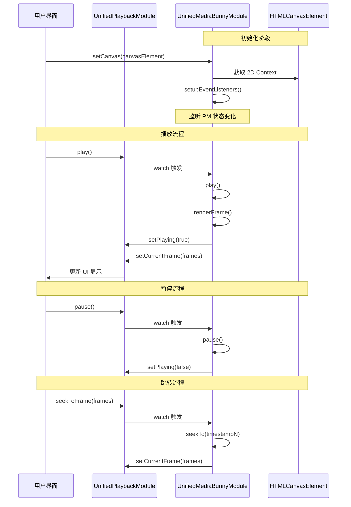

# 替换 WebAV 为 MediaBunny 的详细计划

## 0. 核心设计决策

### 0.1 播放状态管理方案

**采用方案 A：UnifiedPlaybackModule 作为唯一状态源**

- UnifiedPlaybackModule 是播放状态的唯一权威源
- UnifiedMediaBunnyModule 不维护自己的播放状态
- 所有 UI 组件从 UnifiedPlaybackModule 获取播放状态
- MediaBunny 内部使用临时变量，不导出为响应式状态

**优点**：
- 单一数据源，避免状态不一致
- 与现有架构一致（UnifiedWebavModule 也是这样做的）
- UI 统一从 UnifiedPlaybackModule 获取状态

## 1. 当前架构分析

### 1.1 UnifiedWebavModule 与 UnifiedPlaybackModule 的交互

```
UnifiedWebavModule → UnifiedPlaybackModule (单向调用)
├── setupEventListeners() 监听 WebAV 事件
│   ├── 'playing' → playbackModule.setPlaying(true)
│   ├── 'paused' → playbackModule.setPlaying(false)
│   └── 'timeupdate' → playbackModule.setCurrentFrame(frames)
└── watch 监听 playbackModule.currentFrame 变化
    └── 调用 AVCanvas.previewFrame()
```

### 1.2 UnifiedMediaBunnyModule 当前状态

- **独立运行**：有自己的 `playbackState`（需要移除）
- **自实现渲染循环**：使用 `workerTimer` 实现自定义渲染
- **Canvas 管理**：通过 `setCanvas()` 接收外部 Canvas 元素
- **播放控制**：`play()`, `pause()`, `seekTo()` 方法独立工作

### 1.3 播放状态分布

| 模块 | 播放状态 | 用途 |
|------|---------|------|
| UnifiedPlaybackModule | `isPlaying`, `currentFrame` | UI 显示、用户操作 |
| UnifiedMediaBunnyModule | `playbackState.isPlaying`, `playbackState.currentTimeN` | 内部渲染循环（需移除） |

## 2. 替换方案

### 2.1 核心设计原则

1. **UnifiedPlaybackModule 作为播放状态的唯一权威源**
2. **UnifiedMediaBunnyModule 作为渲染引擎，不维护播放状态**
3. **单向同步机制**：
   - MediaBunny → PlaybackModule：播放状态和时间更新（通过事件）
   - PlaybackModule → MediaBunny：用户操作（通过 watch 监听）
4. **MediaBunny 完全从 PlaybackModule 读取状态**：不维护任何播放状态副本

### 2.2 交互架构图



## 3. 详细实施步骤

### 步骤 1: 修改 UnifiedMediaBunnyModule

#### 1.1 添加 UnifiedPlaybackModule 依赖

```typescript
// 在 createUnifiedMediaBunnyModule 函数开头添加
const playbackModule = registry.get<UnifiedPlaybackModule>(MODULE_NAMES.PLAYBACK)
```

#### 1.2 移除 playbackState，只保留必要的内部变量

```typescript
// 移除响应式状态
// const playbackState = ref<PlaybackState>({...})

// 只保留必要的内部变量（非播放状态）
let timelineDurationN: bigint = 0n  // 项目时长
let playbackTimeAtStart: number = 0  // 播放开始时的锚点时间
let audioContextStartTime: number | null = null  // AudioContext 开始时间
```

#### 1.3 修改播放控制方法

```typescript
// 修改 play() 方法
async function play(): Promise<void> {
  if (!audioContext) {
    initializeAudioSystem()
  }
  
  if (audioContext && audioContext.state === 'suspended') {
    await audioContext.resume()
  }
  
  audioContextStartTime = audioContext!.currentTime
  
  // 同步到 PlaybackModule
  playbackModule.setPlaying(true)
  
  console.log('▶️ MediaBunny 开始播放')
}

// 修改 pause() 方法
function pause(): void {
  const currentTimeN = BigInt(playbackModule.currentFrame.value)
  playbackTimeAtStart = Number(currentTimeN) / RENDERER_FPS
  
  stopAllAudioNodes()
  
  // 同步到 PlaybackModule
  playbackModule.setPlaying(false)
  
  console.log('⏸️ MediaBunny 暂停播放')
}

// 修改 seekTo() 方法
async function seekTo(timestampN: bigint): Promise<void> {
  stopAllAudioNodes()
  
  // 限制在有效范围内
  timestampN = timestampN < 0n ? 0n : timestampN
  timestampN = timestampN > timelineDurationN ? timelineDurationN : timestampN
  
  playbackTimeAtStart = Number(timestampN) / RENDERER_FPS
  
  // 转换为帧数并同步到 PlaybackModule
  const frames = Number(timestampN)
  playbackModule.setCurrentFrame(frames)
  
  console.log(`⏩ MediaBunny Seek 到: ${timestampN}帧`)
}
```

#### 1.3 添加事件监听器

```typescript
/**
 * 设置事件监听器
 * 监听 UnifiedPlaybackModule 的状态变化
 */
function setupEventListeners(): void {
  // 监听播放状态变化
  watch(
    () => playbackModule.isPlaying.value,
    (isPlaying) => {
      if (isPlaying && !playbackState.value.isPlaying) {
        // PlaybackModule 请求播放
        play()
      } else if (!isPlaying && playbackState.value.isPlaying) {
        // PlaybackModule 请求暂停
        pause()
      }
    }
  )
  
  // 监听帧数变化（用于跳转）
  watch(
    () => playbackModule.currentFrame.value,
    async (newFrame) => {
      const currentFrameN = BigInt(newFrame)
      if (currentFrameN !== playbackState.value.currentTimeN) {
        await seekTo(currentFrameN)
      }
    }
  )
  
  console.log('✅ MediaBunny 事件监听器已设置')
}
```

#### 1.4 修改 renderFrame() 方法

```typescript
async function renderFrame(): Promise<void> {
  if (!canvas || !ctx || !playbackState.value.isPlaying) {
    return
  }
  
  // 获取依赖模块
  const timelineModule = registry.get<UnifiedTimelineModule>(MODULE_NAMES.TIMELINE)
  const mediaModule = registry.get<UnifiedMediaModule>(MODULE_NAMES.MEDIA)
  
  // 计算当前播放时间
  const currentTime = getCurrentPlaybackTime()
  const currentTimeN = BigInt(Math.floor(currentTime * RENDERER_FPS))
  playbackState.value.currentTime = currentTime
  playbackState.value.currentTimeN = currentTimeN
  
  // 同步到 PlaybackModule
  playbackModule.setCurrentFrame(Number(currentTimeN))
  
  // 检查是否播放结束
  if (currentTimeN >= playbackState.value.durationN) {
    playbackState.value.currentTimeN = playbackState.value.durationN
    playbackState.value.isPlaying = false
    playbackModule.setPlaying(false)
    console.log('✅ 播放结束')
    return
  }
  
  // 更新所有 clips
  await updateClips(timelineModule.timelineItems.value, currentTimeN)
  
  // 渲染到 Canvas
  renderToCanvas(timelineModule.timelineItems.value, mediaModule)
}
```

### 步骤 2: 更新 unifiedStore.ts

#### 2.1 添加 MediaBunny 播放控制方法导出

```typescript
// 在 MediaBunny 模块导出部分添加
// ==================== MediaBunny模块状态和方法 ====================

// MediaBunny状态（移除 playbackState，只保留就绪状态）
isMediaBunnyReady: unifiedMediaBunnyModule.isMediaBunnyReady,
mediaBunnyError: unifiedMediaBunnyModule.mediaBunnyError,

// MediaBunny画布管理
setMediaBunnyCanvas: unifiedMediaBunnyModule.setCanvas,
destroyMediaBunny: unifiedMediaBunnyModule.destroy,

// MediaBunny播放控制
mediaBunnyPlay: unifiedMediaBunnyModule.play,
mediaBunnyPause: unifiedMediaBunnyModule.pause,
mediaBunnySeekTo: unifiedMediaBunnyModule.seekTo,
updateMediaBunnyTimelineDuration: unifiedMediaBunnyModule.updateTimelineDuration,

// MediaBunny工具方法
isMediaBunnyAvailable: unifiedMediaBunnyModule.isMediaBunnyAvailable,
getMediaBunnySummary: unifiedMediaBunnyModule.getMediaBunnySummary,
resetMediaBunnyToDefaults: unifiedMediaBunnyModule.resetToDefaults,
```

### 步骤 3: 更新 usePlaybackControls.ts

#### 3.1 添加 MediaBunny 支持

```typescript
/**
 * 检查MediaBunny是否就绪，如果未就绪则显示警告
 * @param operation 操作名称，用于错误日志
 * @returns 是否就绪
 */
function ensureMediaBunnyReady(operation: string = '操作'): boolean {
  if (!unifiedStore.isMediaBunnyReady) {
    console.warn(`⚠️ MediaBunny not ready for ${operation}`)
    return false
  }
  return true
}

/**
 * 安全地执行 MediaBunny 播放控制操作
 * @param operation 要执行的操作函数
 * @param operationName 操作名称，用于日志
 * @returns 操作是否成功执行
 */
function safeMediaBunnyOperation(operation: () => void, operationName: string): boolean {
  if (!ensureMediaBunnyReady(operationName)) {
    return false
  }

  try {
    operation()
    return true
  } catch (error) {
    console.error(`❌ ${operationName}执行失败:`, error)
    return false
  }
}

/**
 * 安全地使用 MediaBunny 跳转到指定帧数
 * @param frames 目标帧数
 * @returns 是否成功跳转
 */
function safeMediaBunnySeekToFrame(frames: number): boolean {
  return safeMediaBunnyOperation(() => {
    const timestampN = BigInt(frames)
    unifiedStore.mediaBunnySeekTo(timestampN)
  }, 'MediaBunny 跳转帧数')
}

/**
 * 安全地使用 MediaBunny 设置播放状态
 * @param playing 是否播放
 * @returns 是否成功设置
 */
function safeMediaBunnySetPlaying(playing: boolean): boolean {
  return safeMediaBunnyOperation(() => {
    if (playing) {
      unifiedStore.mediaBunnyPlay()
    } else {
      unifiedStore.mediaBunnyPause()
    }
  }, 'MediaBunny 设置播放状态')
}
```

### 步骤 4: 更新 VideoPreviewEngine.vue

#### 4.1 替换 WebAV 检查为 MediaBunny

```vue
<!-- 修改前 -->
<UnifiedTimeline v-if="unifiedStore.isWebAVReady" />
<div v-else class="timeline-loading">
  <div class="loading-spinner"></div>
  <p>{{ t('editor.initializingWebAV') }}</p>
</div>

<!-- 修改后 -->
<UnifiedTimeline v-if="unifiedStore.isMediaBunnyReady" />
<div v-else class="timeline-loading">
  <div class="loading-spinner"></div>
  <p>{{ t('editor.initializingMediaBunny') }}</p>
</div>
```

#### 4.2 更新 watch 监听

```typescript
// 修改前
watch(
  () => unifiedStore.isWebAVReady,
  (isReady, wasReady) => {
    logWebAVReadyStateChange(isReady, wasReady)
  },
  { immediate: true },
)

// 修改后
watch(
  () => unifiedStore.isMediaBunnyReady,
  (isReady, wasReady) => {
    console.log('MediaBunny 就绪状态变化:', { isReady, wasReady })
  },
  { immediate: true },
)
```

### 步骤 5: 更新 BunnyRender.vue

BunnyRender.vue 已经正确实现了 MediaBunny 集成，无需修改。

### 步骤 6: 更新 PreviewWindow.vue

需要检查 PreviewWindow.vue 是否使用了 WebAV 相关方法，并替换为 MediaBunny。

## 4. 需要修改的文件清单

| 文件 | 修改内容 |
|------|---------|
| `UnifiedMediaBunnyModule.ts` | 添加与 UnifiedPlaybackModule 的交互 |
| `unifiedStore.ts` | 添加 MediaBunny 方法导出 |
| `usePlaybackControls.ts` | 添加 MediaBunny 支持方法 |
| `VideoPreviewEngine.vue` | 替换 WebAV 检查为 MediaBunny |
| `PreviewWindow.vue` | 检查并替换 WebAV 调用 |

## 5. 测试验证

### 5.1 功能测试清单

- [ ] MediaBunny Canvas 初始化
- [ ] 播放/暂停控制
- [ ] 帧数跳转
- [ ] 时间同步
- [ ] 播放结束处理
- [ ] 音频播放
- [ ] 视频渲染

### 5.2 兼容性测试

- [ ] 时间轴拖拽
- [ ] 片段选择
- [ ] 属性编辑
- [ ] 历史记录

## 6. 回滚方案

如果替换后出现问题，可以通过以下方式回滚：

1. 恢复 `VideoPreviewEngine.vue` 中的 `isWebAVReady` 检查
2. 恢复 `usePlaybackControls.ts` 中的 WebAV 方法
3. 在 `unifiedStore.ts` 中保留 WebAV 方法导出

## 7. 注意事项

1. **时间单位转换**：MediaBunny 使用 `bigint` (帧数)，PlaybackModule 使用 `number` (帧数)
2. **渲染循环**：MediaBunny 使用自定义渲染循环，不依赖 WebAV 的 `AVCanvas`
3. **音频系统**：MediaBunny 使用 Web Audio API，需要正确处理音频调度
4. **状态同步**：确保双向同步不会导致循环调用