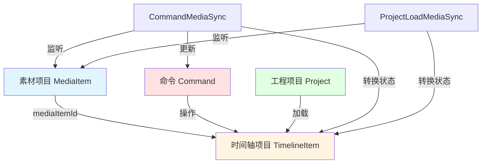
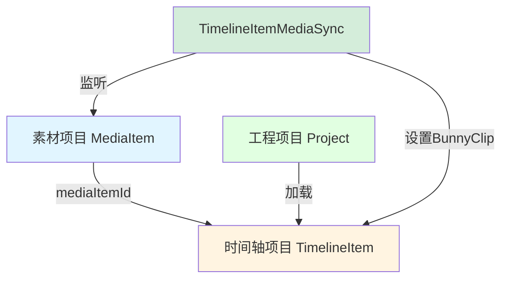

# MediaSync机制简化方案完整指南

## 目录

1. [当前架构分析](#一当前架构分析)
2. [简化方案设计](#二简化方案设计)
3. [命令文件修改指南](#三命令文件修改指南)
4. [实施计划](#四实施计划)
5. [测试与验证](#五测试与验证)

---

## 一、当前架构分析

### 1.1 核心组件关系

```
MediaSyncFactory (工厂类)
    ├── forCommand() → CommandMediaSync
    └── forProjectLoad() → ProjectLoadMediaSync
         ↓
    BaseMediaSync (抽象基类)
         ↓
    ├── CommandMediaSync (命令场景)
    └── ProjectLoadMediaSync (项目加载场景)
         ↓
    TimelineItemTransitioner (状态转换器)
         ↓
    setupTimelineItemBunny() (设置BunnyClip的核心函数)
```

### 1.2 涉及的实体关系



### 1.3 当前同步机制的工作流程

#### CommandMediaSync (命令场景)
```
用户执行命令 (如AddTimelineItemCommand)
    ↓
创建TimelineItem (状态: loading)
    ↓
MediaSyncFactory.forCommand(commandId, mediaItemId, timelineItemId)
    ↓
监听MediaItem的mediaStatus变化
    ↓
当mediaStatus变为ready时:
    1. 更新Command中的媒体数据 (command.updateMediaData) ❌ 冗余
    2. 调用TimelineItemTransitioner.transitionToReady()
       ├── 更新TimelineItem的尺寸和时长
       └── 调用setupTimelineItemBunny(timelineItem, mediaItem)
           └── 创建BunnyClip并设置到timelineItem.runtime.bunnyClip
    3. 转换TimelineItem状态 (loading → ready)
    ↓
自动清理同步
```

#### ProjectLoadMediaSync (项目加载场景)
```
加载工程项目
    ↓
恢复TimelineItem (状态: loading)
    ↓
MediaSyncFactory.forProjectLoad(mediaItemId, timelineItemId)
    ↓
监听MediaItem的mediaStatus变化
    ↓
当mediaStatus变为ready时:
    1. 调用TimelineItemTransitioner.transitionToReady()
       └── 调用setupTimelineItemBunny(timelineItem, mediaItem)
           └── 创建BunnyClip并设置到timelineItem.runtime.bunnyClip
    2. 转换TimelineItem状态 (loading → ready)
    ↓
自动清理同步
```

### 1.4 核心函数说明

#### setupTimelineItemBunny()
位置：[`LightCut-frontend/src/core/bunnyUtils/timelineItemSetup.ts:17`](LightCut-frontend/src/core/bunnyUtils/timelineItemSetup.ts:17)

**职责：** 为TimelineItem创建对应的Bunny对象（BunnyClip或textBitmap）

```typescript
export async function setupTimelineItemBunny(
  timelineItem: UnifiedTimelineItemData,
  mediaItem?: UnifiedMediaItemData,
): Promise<void>
```

**处理逻辑：**
- **文本类型：** 创建textBitmap并存储到 `timelineItem.runtime.textBitmap`
- **音视频类型：** 创建BunnyClip并存储到 `timelineItem.runtime.bunnyClip`
- **图片类型：** 使用mediaItem的imageClip

#### TimelineItemTransitioner
位置：[`LightCut-frontend/src/core/managers/media/sync/TimelineItemTransitioner.ts:23`](LightCut-frontend/src/core/managers/media/sync/TimelineItemTransitioner.ts:23)

**职责：** 将TimelineItem从loading状态转换为ready状态

### 1.5 当前机制的问题

#### 问题1：CommandMediaSync的冗余性
```typescript
// CommandMediaSync做了两件事：
protected async handleReadyMedia(mediaItem: UnifiedMediaItemData): Promise<void> {
    // 1. 更新命令中的媒体数据 ❌ 这一步是多余的
    const command = store.getCommand(this.commandId)
    if (command && !command.isDisposed) {
        command.updateMediaData?.(mediaItem, this.timelineItemId)
    }

    // 2. 转换时间轴项目状态 ✅ 这才是真正需要的
    if (this.timelineItemId) {
        await this.transitionTimelineItem(mediaItem)
    }
}
```

**为什么第1步是多余的？**
- 命令执行时，素材项目必须已经ready才能加入时间轴
- 如果素材还在loading，命令根本不应该执行
- 命令不需要"等待"素材ready，因为素材ready是命令执行的前提条件

#### 问题2：两种场景的本质相同
CommandMediaSync和ProjectLoadMediaSync的核心逻辑完全一样：都是等待MediaItem ready后，转换TimelineItem状态

#### 问题3：架构过度设计
- 两个场景类（CommandMediaSync、ProjectLoadMediaSync）
- 一个工厂类（MediaSyncFactory）
- 一个管理器类（MediaSyncManager）
- 一个基类（BaseMediaSync）
- 实际上只需要一个简单的同步机制

---

## 二、简化方案设计

### 2.1 核心思想

**关键认知：**
1. **命令场景不需要同步** - 素材ready是命令执行的前提条件
2. **只有项目加载需要同步** - 因为加载时素材可能还在处理中
3. **同步的本质** - 等待素材ready后设置TimelineItem的BunnyClip

### 2.2 简化后的架构



### 2.3 新的工作流程

#### 命令场景（无需同步）
```
用户执行命令
    ↓
检查素材是否ready ✅
    ↓
如果ready:
    TimelineItemFactory.rebuildForCmd()
        ↓
    创建TimelineItem (状态: ready)
        ↓
    直接调用setupTimelineItemBunny()
        ↓
    设置BunnyClip完成 ✅
    
如果not ready: 拒绝执行命令 ❌
```

#### 项目加载场景（需要同步）
```
加载工程项目
    ↓
TimelineItemFactory.rebuildForProjLoad()
    ↓
创建TimelineItem (状态: loading)
    ↓
TimelineItemMediaSync.setup(timelineItemId)
    ↓
监听对应MediaItem的状态
    ↓
当mediaStatus变为ready时:
    调用setupTimelineItemBunny()
    设置TimelineItem状态为ready
    ↓
自动清理同步
```

### 2.4 TimelineItemFactory的两个重建方法

#### rebuildForCmd (命令场景)
```typescript
/**
 * 为命令场景重建时间轴项目
 * 前提：素材必须已经ready
 * 结果：直接创建ready状态的TimelineItem
 */
async function rebuildForCmd(options: {
    originalTimelineItemData: UnifiedTimelineItemData
    getMediaItem: (id: string) => UnifiedMediaItemData | undefined
}): Promise<UnifiedTimelineItemData> {
    const mediaItem = getMediaItem(originalTimelineItemData.mediaItemId)
    
    // ✅ 前置检查：素材必须ready
    if (!mediaItem || mediaItem.mediaStatus !== 'ready') {
        throw new Error('素材未就绪，无法执行命令')
    }
    
    // 创建TimelineItem
    const timelineItem = cloneTimelineItem(originalTimelineItemData, {
        timelineStatus: 'ready' // ✅ 直接设置为ready
    })
    
    // ✅ 立即设置BunnyClip
    await setupTimelineItemBunny(timelineItem, mediaItem)
    
    return timelineItem
}
```

#### rebuildForProjLoad (项目加载场景)
```typescript
/**
 * 为项目加载场景重建时间轴项目
 * 特点：素材可能还在loading中
 * 结果：创建loading状态的TimelineItem，等待后续同步
 */
async function rebuildForProjLoad(options: {
    originalTimelineItemData: UnifiedTimelineItemData
    getMediaItem: (id: string) => UnifiedMediaItemData | undefined
}): Promise<UnifiedTimelineItemData> {
    // 创建TimelineItem
    const timelineItem = cloneTimelineItem(originalTimelineItemData, {
        timelineStatus: 'loading' // ✅ 设置为loading，等待同步
    })
    
    // ❌ 不立即设置BunnyClip，由TimelineItemMediaSync处理
    
    return timelineItem
}
```

### 2.5 简化后的同步代码结构

```typescript
/**
 * 时间轴项目媒体同步
 * 仅用于项目加载场景
 */
export class TimelineItemMediaSync {
    constructor(
        private timelineItemId: string,
    ) {}

    async setup(): Promise<void> {
        const timelineItem = getTimelineItem(this.timelineItemId)
        if (!timelineItem) return

        const mediaItem = getMediaItem(timelineItem.mediaItemId)
        if (!mediaItem) return

        // 如果素材已ready，直接设置
        if (mediaItem.mediaStatus === 'ready') {
            await this.setupBunny(timelineItem, mediaItem)
            return
        }

        // 否则监听状态变化
        this.unwatch = watch(
            () => mediaItem.mediaStatus,
            async (status) => {
                if (status === 'ready') {
                    await this.setupBunny(timelineItem, mediaItem)
                    this.cleanup()
                }
            }
        )
    }

    private async setupBunny(
        timelineItem: UnifiedTimelineItemData,
        mediaItem: UnifiedMediaItemData
    ): Promise<void> {
        // ✅ 直接调用现有的setupTimelineItemBunny函数
        await setupTimelineItemBunny(timelineItem, mediaItem)
        timelineItem.timelineStatus = 'ready'
    }

    cleanup(): void {
        if (this.unwatch) {
            this.unwatch()
        }
    }
}
```

### 2.6 简化收益

#### 代码量变化
- **删除文件：**
  - `CommandMediaSync.ts` (169行)
  - `MediaSyncFactory.ts` (61行)
  - 简化 `BaseMediaSync.ts` (从106行减少到约50行)
  
- **新增/修改文件：**
  - 重命名 `ProjectLoadMediaSync.ts` 为 `TimelineItemMediaSync.ts` (保持约150行)
  - 新增 `TimelineItemFactory.rebuildForCmd()` (约30行)
  - 新增 `TimelineItemFactory.rebuildForProjLoad()` (约20行)
  
- **净减少：** 约130行代码

#### 架构优势对比

| 方面 | 简化前 | 简化后 |
|------|--------|--------|
| **命令场景** | 创建loading → 等待同步 → 转换ready | 检查ready → 直接创建ready + BunnyClip |
| **项目加载** | 创建loading → 等待同步 → 转换ready | 创建loading → 等待同步 → 转换ready |
| **同步类数量** | 2个（CommandMediaSync + ProjectLoadMediaSync） | 1个（TimelineItemMediaSync） |
| **工厂方法** | 1个（rebuildForCmd统一处理） | 2个（rebuildForCmd + rebuildForProjLoad） |
| **代码复杂度** | 高（多层抽象） | 低（职责清晰） |

---

## 三、命令文件修改指南

### 3.1 需要修改的文件

1. [`AddTimelineItemCommand.ts`](LightCut-frontend/src/core/modules/commands/AddTimelineItemCommand.ts)
2. [`RemoveTimelineItemCommand.ts`](LightCut-frontend/src/core/modules/commands/RemoveTimelineItemCommand.ts)
3. [`RemoveTrackCommand.ts`](LightCut-frontend/src/core/modules/commands/RemoveTrackCommand.ts)
4. ✅ [`SplitTimelineItemCommand.ts`](LightCut-frontend/src/core/modules/commands/SplitTimelineItemCommand.ts) - **已经正确实现！**

### 3.2 关键发现

**SplitTimelineItemCommand已经按照简化方案实现了！** 它展示了正确的模式：
- ✅ 使用 `rebuildForCmd` 创建TimelineItem
- ✅ 直接调用 `setupTimelineItemBunny()` 设置BunnyClip
- ✅ 设置状态为 `ready`
- ✅ 不使用任何MediaSync机制

这是我们应该遵循的标准模式！

### 3.3 统一的修改模式

所有命令的execute()和undo()方法都应该遵循这个模式：

```typescript
// 1. 前置检查素材状态
const mediaItem = this.mediaModule.getMediaItem(mediaItemId)
if (!mediaItem || mediaItem.mediaStatus !== 'ready') {
    throw new Error('素材未就绪')
}

// 2. 使用rebuildForCmd重建
const rebuildResult = await TimelineItemFactory.rebuildForCmd({
    originalTimelineItemData: itemData,
    getMediaItem: this.mediaModule.getMediaItem,
    logIdentifier: 'CommandName',
})

const timelineItem = rebuildResult.timelineItem

// 3. 直接设置BunnyClip
await setupTimelineItemBunny(timelineItem, mediaItem)
timelineItem.timelineStatus = 'ready'

// 4. 添加到时间轴
await this.timelineModule.addTimelineItem(timelineItem)
```

### 3.4 AddTimelineItemCommand.ts 修改

#### 修改后的execute()方法
```typescript
async execute(): Promise<void> {
    if (!this.originalTimelineItemData) {
        throw new Error('没有有效的时间轴项目数据')
    }
    
    try {
        console.log(`🔄 执行添加操作：从源头重建时间轴项目...`)

        // 1. 获取媒体项目并检查状态
        const mediaItem = this.mediaModule.getMediaItem(
            this.originalTimelineItemData.mediaItemId
        )
        
        if (!mediaItem) {
            throw new Error(`找不到关联的媒体项目: ${this.originalTimelineItemData.mediaItemId}`)
        }
        
        // ✅ 前置检查：素材必须ready
        if (mediaItem.mediaStatus !== 'ready') {
            throw new Error(`素材未就绪，无法添加到时间轴: ${mediaItem.name}`)
        }

        // 2. 使用rebuildForCmd重建TimelineItem
        const rebuildResult = await TimelineItemFactory.rebuildForCmd({
            originalTimelineItemData: this.originalTimelineItemData,
            getMediaItem: this.mediaModule.getMediaItem,
            logIdentifier: 'AddTimelineItemCommand execute',
        })

        if (!rebuildResult.success) {
            throw new Error(`重建时间轴项目失败: ${rebuildResult.error}`)
        }

        const newTimelineItem = rebuildResult.timelineItem

        // 3. ✅ 直接调用setupTimelineItemBunny设置BunnyClip
        await setupTimelineItemBunny(newTimelineItem, mediaItem)
        
        // 4. ✅ 设置状态为ready
        newTimelineItem.timelineStatus = 'ready'

        // 5. 添加到时间轴
        await this.timelineModule.addTimelineItem(newTimelineItem)

        console.log(`✅ 已添加时间轴项目: ${this.originalTimelineItemData.id}`)
    } catch (error) {
        console.error(`❌ 添加时间轴项目失败: ${this.originalTimelineItemData.id}`, error)
        throw error
    }
}
```

### 3.5 RemoveTimelineItemCommand.ts 修改

#### 修改后的execute()方法
```typescript
async execute(): Promise<void> {
    try {
        const existingItem = this.timelineModule.getTimelineItem(this.timelineItemId)
        if (!existingItem) {
            console.warn(`⚠️ 时间轴项目不存在，无法删除: ${this.timelineItemId}`)
            return
        }

        if (!this.originalTimelineItemData) {
            this.originalTimelineItemData = TimelineItemFactory.clone(existingItem)
        }

        // ✅ 删除时不需要任何MediaSync
        await this.timelineModule.removeTimelineItem(this.timelineItemId)
        console.log(`↩️ 已删除时间轴项目: ${this.timelineItemId}`)
    } catch (error) {
        console.error(`❌ 删除时间轴项目失败: ${this.timelineItemId}`, error)
        throw error
    }
}
```

#### 修改后的undo()方法
```typescript
async undo(): Promise<void> {
    if (!this.originalTimelineItemData) {
        throw new Error('没有有效的时间轴项目数据')
    }
    
    try {
        console.log(`🔄 执行撤销删除操作：从源头重建时间轴项目...`)

        // 1. 获取媒体项目并检查状态
        const mediaItem = this.mediaModule.getMediaItem(
            this.originalTimelineItemData.mediaItemId
        )
        
        if (!mediaItem) {
            throw new Error(`找不到关联的媒体项目: ${this.originalTimelineItemData.mediaItemId}`)
        }
        
        // ✅ 前置检查：素材必须ready
        if (mediaItem.mediaStatus !== 'ready') {
            throw new Error(`素材未就绪，无法恢复到时间轴: ${mediaItem.name}`)
        }

        // 2. 使用rebuildForCmd重建
        const rebuildResult = await TimelineItemFactory.rebuildForCmd({
            originalTimelineItemData: this.originalTimelineItemData,
            getMediaItem: this.mediaModule.getMediaItem,
            logIdentifier: 'RemoveTimelineItemCommand undo',
        })

        if (!rebuildResult.success) {
            throw new Error(`重建时间轴项目失败: ${rebuildResult.error}`)
        }

        const newTimelineItem = rebuildResult.timelineItem

        // 3. ✅ 直接设置BunnyClip
        await setupTimelineItemBunny(newTimelineItem, mediaItem)
        newTimelineItem.timelineStatus = 'ready'

        // 4. 添加到时间轴
        await this.timelineModule.addTimelineItem(newTimelineItem)

        console.log(`✅ 已撤销删除时间轴项目: ${this.originalTimelineItemData.id}`)
    } catch (error) {
        console.error(`❌ 撤销删除时间轴项目失败: ${this.originalTimelineItemData.id}`, error)
        throw error
    }
}
```

### 3.6 RemoveTrackCommand.ts 修改

#### 修改后的execute()方法
```typescript
async execute(): Promise<void> {
    try {
        console.log(`🔄 执行删除轨道操作: ${this.trackData.name}...`)

        if (this.trackModule.tracks.value.length <= 1) {
            throw new Error('不能删除最后一个轨道')
        }

        const track = this.trackModule.getTrack(this.trackId)
        if (!track) {
            console.warn(`⚠️ 轨道不存在，无法删除: ${this.trackId}`)
            return
        }

        // ✅ 删除轨道时不需要任何MediaSync
        await this.trackModule.removeTrack(this.trackId)

        console.log(
            `✅ 已删除轨道: ${this.trackData.name}, 删除了 ${this.affectedTimelineItems.length} 个时间轴项目`,
        )
    } catch (error) {
        console.error(`❌ 删除轨道失败: ${this.trackData.name}`, error)
        throw error
    }
}
```

#### 修改后的undo()方法
```typescript
async undo(): Promise<void> {
    try {
        console.log(`🔄 撤销删除轨道操作：重建轨道 ${this.trackData.name}...`)

        // 1. 重建轨道
        this.trackModule.addTrack({ ...this.trackData }, this.trackIndex)

        // 2. 重建所有受影响的时间轴项目
        for (const itemData of this.affectedTimelineItems) {
            // 获取媒体项目并检查状态
            const mediaItem = this.mediaModule.getMediaItem(itemData.mediaItemId)
            
            if (!mediaItem) {
                throw new Error(`找不到关联的媒体项目: ${itemData.mediaItemId}`)
            }
            
            // ✅ 前置检查：素材必须ready
            if (mediaItem.mediaStatus !== 'ready') {
                throw new Error(`素材未就绪，无法恢复到时间轴: ${mediaItem.name}`)
            }

            // 使用rebuildForCmd重建
            const rebuildResult = await TimelineItemFactory.rebuildForCmd({
                originalTimelineItemData: itemData,
                getMediaItem: this.mediaModule.getMediaItem,
                logIdentifier: 'RemoveTrackCommand undo',
            })

            if (!rebuildResult.success) {
                throw new Error(`重建时间轴项目失败: ${rebuildResult.error}`)
            }

            const newTimelineItem = rebuildResult.timelineItem

            // ✅ 直接设置BunnyClip
            await setupTimelineItemBunny(newTimelineItem, mediaItem)
            newTimelineItem.timelineStatus = 'ready'

            // 添加到时间轴
            await this.timelineModule.addTimelineItem(newTimelineItem)
            
            console.log(`✅ 已恢复时间轴项目: ${itemData.id}`)
        }

        console.log(
            `↩️ 已撤销删除轨道: ${this.trackData.name}, 恢复了 ${this.affectedTimelineItems.length} 个时间轴项目`,
        )
    } catch (error) {
        console.error(`❌ 撤销删除轨道失败: ${this.trackData.name}`, error)
        throw error
    }
}
```

### 3.7 需要删除的通用代码

所有命令文件都需要删除：

1. **导入语句**
```typescript
// ❌ 删除
import { MediaSyncFactory, cleanupCommandMediaSync } from '@/core/managers/media'
```

2. **MediaSync相关调用**
```typescript
// ❌ 删除所有这样的代码
if (TimelineItemQueries.isLoading(item)) {
    MediaSyncFactory.forCommand(...).setup()
}
```

3. **updateMediaData方法**
```typescript
// ❌ 删除整个方法
updateMediaData(mediaData: UnifiedMediaItemData, timelineItemId?: string): void {
    // ...
}
```

4. **dispose()中的清理**
```typescript
// ❌ 删除
cleanupCommandMediaSync(this.id)
```

### 3.8 需要添加的通用代码

所有命令文件都需要添加：

```typescript
// ✅ 添加导入
import { setupTimelineItemBunny } from '@/core/bunnyUtils/timelineItemSetup'
```

---

## 四、实施计划

### 4.1 第一阶段：扩展TimelineItemFactory
- [ ] 在 `TimelineItemFactory` 中新增 `rebuildForCmd()` 方法
  - 前置检查素材ready状态
  - 直接创建ready状态的TimelineItem
  - 立即调用setupTimelineItemBunny()
- [ ] 在 `TimelineItemFactory` 中新增 `rebuildForProjLoad()` 方法
  - 创建loading状态的TimelineItem
  - 不设置BunnyClip
- [ ] 添加单元测试

### 4.2 第二阶段：修改命令逻辑
- [ ] 修改 `AddTimelineItemCommand.ts`
  - 使用 `TimelineItemFactory.rebuildForCmd()`
  - 移除MediaSyncFactory调用
  - 添加素材ready前置检查
- [ ] 修改 `RemoveTimelineItemCommand.ts`
- [ ] 修改 `RemoveTrackCommand.ts`
- [ ] 测试命令执行流程

### 4.3 第三阶段：修改项目加载逻辑
- [ ] 修改 `UnifiedProjectModule.ts` 的 `restoreTimelineItems`
  - 使用 `TimelineItemFactory.rebuildForProjLoad()`
  - 替换 `MediaSyncFactory.forProjectLoad()` 为简化的 `TimelineItemMediaSync`
- [ ] 测试项目加载流程

### 4.4 第四阶段：重构同步类
- [ ] 重命名 `ProjectLoadMediaSync.ts` 为 `TimelineItemMediaSync.ts`
- [ ] 简化实现，直接调用 `setupTimelineItemBunny()`
- [ ] 移除不必要的抽象层

### 4.5 第五阶段：清理旧代码
- [ ] 删除 `CommandMediaSync.ts`
- [ ] 删除 `MediaSyncFactory.ts`
- [ ] 简化 `BaseMediaSync.ts`（如果还需要的话）
- [ ] 更新导出文件 `index.ts`
- [ ] 清理相关导入

### 4.6 第六阶段：全面测试
- [ ] 测试命令执行流程（添加、删除、修改）
- [ ] 测试项目加载流程
- [ ] 测试撤销/重做功能
- [ ] 测试素材未ready时的错误处理
- [ ] 性能测试和内存泄漏检查

---

## 五、测试与验证

### 5.1 测试场景

#### 正常流程
- 添加素材到时间轴
- 删除时间轴项目
- 删除轨道
- 分割时间轴项目

#### 撤销/重做
- 每个命令的撤销操作
- 每个命令的重做操作
- 连续多次撤销/重做

#### 错误处理
- 素材未ready时执行命令（应该抛出错误）
- 素材不存在时执行命令（应该抛出错误）

#### 性能
- 命令执行速度应该更快（不再有watcher开销）
- 内存占用应该更少（不再有MediaSync对象）

### 5.2 注意事项

1. **素材ready检查是关键**
   - 所有命令执行前都必须检查素材是否ready
   - 如果素材未ready，应该抛出明确的错误信息

2. **不要混用新旧模式**
   - 不要在同一个命令中既使用MediaSync又使用setupTimelineItemBunny
   - 要么全部使用新模式，要么保持旧模式（但我们要全部改为新模式）

3. **参考SplitTimelineItemCommand**
   - 这是最好的参考实现
   - 其他命令应该遵循相同的模式

4. **测试充分**
   - 每个命令修改后都要充分测试
   - 特别注意撤销/重做功能

### 5.3 风险评估

#### 潜在风险
1. **命令执行时素材未ready** - 通过前置检查解决
2. **项目加载时的兼容性** - 保持原有的loading状态逻辑
3. **现有代码依赖** - 需要全面搜索和替换

#### 回滚方案
- 保留旧代码的git历史
- 分阶段迁移，每个阶段都可以独立回滚
- 充分的测试覆盖

---

## 六、总结

### 6.1 核心改进
1. **消除冗余** - 命令场景不再需要同步机制
2. **明确职责** - TimelineItemFactory区分两种场景的重建逻辑
3. **简化架构** - 从2种同步场景简化为1种场景
4. **提升性能** - 减少不必要的watcher和内存占用
5. **增强可维护性** - 代码更清晰，概念更简单

### 6.2 关键认知
- **素材ready是命令执行的前提** - 不是命令执行后的等待结果
- **只有项目加载需要等待** - 因为加载时素材可能还在处理中
- **TimelineItemFactory应该区分场景** - rebuildForCmd vs rebuildForProjLoad
- **同步的本质是设置BunnyClip** - 直接复用setupTimelineItemBunny()

### 6.3 下一步行动
1. 与团队讨论这个简化方案
2. 确认没有遗漏的使用场景
3. 按照6个阶段的迁移计划逐步实施
4. 重点关注命令场景的素材ready前置检查
5. 确保项目加载场景的兼容性