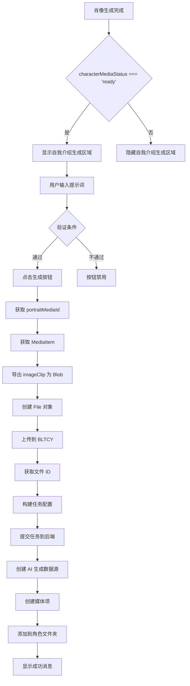
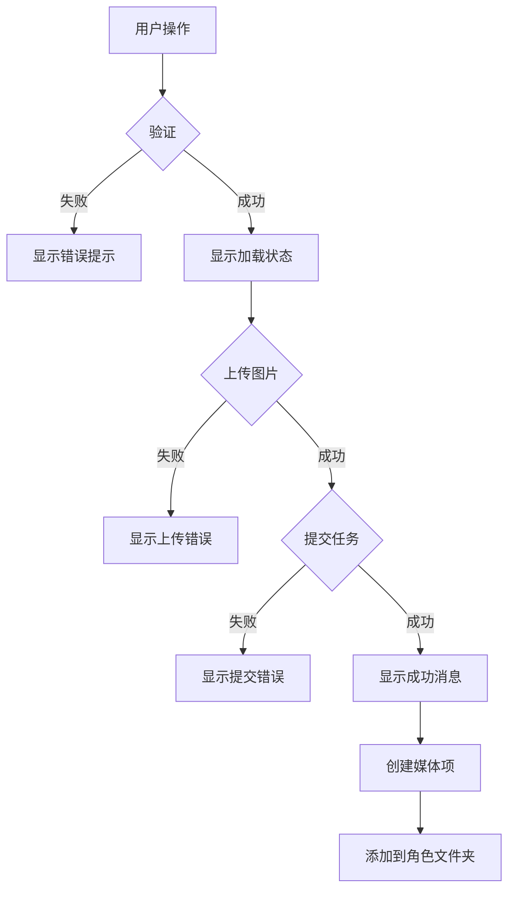

# 角色自我介绍生成功能实施方案

## 一、需求分析

### 1.1 功能目标
在 [`CharacterEditor.vue`](../LightCut-frontend/src/aipanel/character/CharacterEditor.vue) 中添加第二部分生成内容：
- 添加一个提示词输入框
- 添加一个【生成自我介绍】按钮
- **固定参数**：9:16竖屏，10秒时长
- **显示条件**：只有当肖像媒体处于就绪状态（`characterMediaStatus === 'ready'`）时才显示
- 将 `portraitMediaId` 对应的媒体的 `runtime.bunny.imageClip` 转换为 blob
- 通过 `BltcyFileUploader` 上传图片
- 参考 [`bltcy-sora2.json`](../LightCut-frontend/src/aipanel/aigenerate/configs/bltcy-sora2.json) 的 `aiConfig` 提交任务

### 1.2 现有代码分析

#### 当前 CharacterEditor.vue 结构
```
- 标题栏（角色名称 + 退出按钮）
- 角色名称输入框
- 角色描述输入框（用于生成肖像）
- 参考图上传区域
- 图像比例选择器
- 【生成肖像】按钮（第一部分）
```

#### 关键技术点
1. **状态检测**：使用 [`useCharacter`](../LightCut-frontend/src/core/composables/useCharacter.ts) composable 的 `characterMediaStatus` 判断肖像是否就绪
2. **条件渲染**：只有当 `characterMediaStatus === 'ready'` 时才显示自我介绍生成区域
3. **媒体项获取**：通过 `portraitMediaId` 从 `unifiedStore.getMediaItem()` 获取媒体项
4. **ImageClip 导出**：使用 [`exportMediaItem()`](../LightCut-frontend/src/core/utils/projectExporter.ts:724) 将 `imageClip` 转换为 PNG Blob
5. **文件上传**：使用 [`BltcyFileUploader.uploadFile()`](../LightCut-frontend/src/core/utils/bltcyFileUploader.ts:77) 上传文件
6. **任务提交**：参考 [`bltcy-sora2.json`](../LightCut-frontend/src/aipanel/aigenerate/configs/bltcy-sora2.json) 的配置结构

## 二、UI 设计方案

### 2.1 布局结构

```
┌─────────────────────────────────────────┐
│ 【第一部分：角色肖像生成】              │
│ - 角色名称                              │
│ - 角色描述                              │
│ - 参考图                                │
│ - 图像比例                              │
│ - [生成肖像] 按钮                       │
├─────────────────────────────────────────┤
│ 【分隔线】                              │
├─────────────────────────────────────────┤
│ 【第二部分：自我介绍生成】              │
│ - 提示词输入框（多行文本）              │
│ - [生成自我介绍] 按钮                   │
│   （固定参数：9:16竖屏，10秒时长）      │
└─────────────────────────────────────────┘
```

### 2.2 UI 组件设计

**重要**：整个第二部分需要使用 `v-if="showIntroSection"` 条件渲染，只有当肖像媒体处于就绪状态时才显示。

#### 分隔区域
```vue
<!-- 分隔线 - 只有肖像就绪时才显示 -->
<div v-if="showIntroSection" class="section-divider">
  <div class="divider-line"></div>
  <span class="divider-text">自我介绍生成</span>
  <div class="divider-line"></div>
</div>
```

#### 提示词输入框
```vue
<!-- 只有肖像就绪时才显示 -->
<div v-if="showIntroSection" class="form-group">
  <label>{{ tFunc('media.character.introPrompt') }}</label>
  <textarea
    v-model="introPrompt"
    class="form-textarea"
    :placeholder="tFunc('media.character.introPromptPlaceholder')"
    rows="6"
  />
</div>
```

#### 生成按钮
```vue
<!-- 只有肖像就绪时才显示 -->
<div v-if="showIntroSection" class="form-actions">
  <HoverButton
    v-if="!isGeneratingIntro && !isMediaLoading"
    variant="large"
    class="generate-intro-button"
    :disabled="!canGenerateIntro"
    @click="handleGenerateIntro"
  >
    <template #icon>
      <component :is="IconComponents.SPARKLING" size="16px" />
    </template>
    {{ tFunc('media.character.generateIntro') }}
  </HoverButton>

  <!-- 加载提示框 -->
  <div v-else-if="isGeneratingIntro" class="loading-indicator">
    <component :is="IconComponents.LOADING" size="24px" class="loading-icon" />
    <span class="loading-text">{{ tFunc('aiPanel.generating') }}</span>
  </div>
</div>
```

### 2.3 样式设计

```css
/* 分隔区域 */
.section-divider {
  display: flex;
  align-items: center;
  gap: var(--spacing-md);
  margin: var(--spacing-xl) 0;
}

.divider-line {
  flex: 1;
  height: 1px;
  background-color: var(--color-border-secondary);
}

.divider-text {
  font-size: var(--font-size-md);
  font-weight: 600;
  color: var(--color-text-secondary);
  white-space: nowrap;
}

/* 生成自我介绍按钮 */
.form-actions :deep(.generate-intro-button) {
  background-color: #1890ff;
  color: #fff;
}

.form-actions :deep(.generate-intro-button:hover:not(:disabled)) {
  background-color: #40a9ff;
}

.form-actions :deep(.generate-intro-button:disabled) {
  background-color: #d9d9d9;
  color: #8c8c8c;
}
```

## 三、数据流和状态管理方案

### 3.1 响应式状态

```typescript
// 自我介绍生成相关状态
const isGeneratingIntro = ref(false)
const introPrompt = ref('')
// 固定参数：9:16竖屏，10秒时长
const VIDEO_ASPECT_RATIO = '9:16'
const VIDEO_DURATION = '10'

// 使用 useCharacter composable 获取角色状态
const characterComposable = useCharacter(currentCharacterDirId.value)
```

### 3.2 计算属性

```typescript
// 是否显示自我介绍生成区域
// 只有当肖像媒体处于就绪状态时才显示
const showIntroSection = computed(() => {
  return characterComposable.characterMediaStatus.value === 'ready'
})

// 是否可以生成自我介绍
const canGenerateIntro = computed(() => {
  // 1. 肖像必须就绪（通过 showIntroSection 已经验证）
  if (!showIntroSection.value) {
    return false
  }

  // 2. 提示词不能为空且长度至少10个字符
  const prompt = introPrompt.value.trim()
  return prompt.length >= 10
})
```

### 3.3 数据流图



## 四、文件上传和任务提交流程

### 4.1 核心流程

```typescript
async function handleGenerateIntro() {
  if (!canGenerateIntro.value) return

  isGeneratingIntro.value = true
  try {
    const character = unifiedStore.curCharacterDir
    if (!character) {
      throw new Error('角色文件夹不存在')
    }

    await generateCharacterIntro(character.id)
    unifiedStore.messageSuccess(tFunc('media.character.generateIntroSuccess'))
  } catch (error) {
    console.error('生成自我介绍失败:', error)
    const errorMessage =
      error instanceof Error ? error.message : tFunc('media.character.generateIntroFailed')
    unifiedStore.messageError(errorMessage)
  } finally {
    isGeneratingIntro.value = false
  }
}
```

### 4.2 详细实现步骤

```typescript
async function generateCharacterIntro(characterId: string): Promise<void> {
  // 1. 获取角色文件夹
  const characterDir = unifiedStore.curCharacterDir
  if (!characterDir) {
    throw new Error('角色文件夹不存在')
  }

  // 2. 获取肖像媒体项
  const portraitMediaId = characterDir.character.portraitMediaId
  if (!portraitMediaId) {
    throw new Error(tFunc('media.character.noPortrait'))
  }

  const mediaItem = unifiedStore.getMediaItem(portraitMediaId)
  if (!mediaItem) {
    throw new Error('找不到肖像媒体项')
  }

  // 3. 验证媒体项状态
  if (!MediaItemQueries.isReady(mediaItem)) {
    throw new Error(tFunc('media.character.portraitNotReady'))
  }

  // 4. 导出 imageClip 为 Blob
  console.log('📤 [CharacterEditor] 导出肖像图片...')
  const imageBlob = await exportMediaItem({ mediaItem })

  // 5. 创建 File 对象
  const imageFile = new File([imageBlob], `${characterDir.name}_portrait.png`, {
    type: 'image/png',
  })

  // 6. 上传到 BLTCY
  console.log('☁️ [CharacterEditor] 上传图片到 BLTCY...')
  const uploadResult = await BltcyFileUploader.uploadFile(imageFile, {
    onProgress: (progress) => {
      console.log(`上传进度: ${progress}%`)
    },
  })

  if (!uploadResult.success || !uploadResult.id) {
    throw new Error(`图片上传失败: ${uploadResult.error}`)
  }

  console.log('✅ [CharacterEditor] 图片上传成功:', uploadResult.id)

  // 7. 构建任务配置（参考 bltcy-sora2.json）
  // 固定使用 9:16 竖屏，10秒时长
  const taskConfig = {
    images: [uploadResult.id], // 使用上传后的文件 ID
    prompt: introPrompt.value.trim(),
    aspect_ratio: '9:16',
    duration: '10',
  }

  // 8. 准备请求参数
  const requestParams = {
    ai_task_type: AITaskType.BLTCY_SORA2,
    content_type: ContentType.VIDEO,
    task_config: taskConfig,
  }

  console.log('🚀 [CharacterEditor] 提交自我介绍生成任务...', requestParams)

  // 9. 提交任务到后端
  const submitResult = await submitAIGenerationTask(requestParams)

  // 10. 错误处理
  if (!submitResult.success) {
    const errorMessage = buildTaskErrorMessage(
      submitResult.error_code,
      submitResult.error_details,
      tFunc,
    )
    throw new Error(errorMessage)
  }

  console.log(
    `✅ [CharacterEditor] 任务提交成功: ${submitResult.task_id}, 成本: ${submitResult.cost}`,
  )

  // 11. 创建 AI 生成数据源
  const aiSource = AIGenerationSourceFactory.createAIGenerationSource(
    {
      type: 'ai-generation',
      aiTaskId: submitResult.task_id,
      requestParams: requestParams,
      taskStatus: TaskStatus.PENDING,
    },
    SourceOrigin.USER_CREATE,
  )

  // 12. 生成媒体ID
  const mediaId = generateMediaId('mp4')

  // 13. 创建媒体项
  const mediaItem = unifiedStore.createUnifiedMediaItemData(
    mediaId,
    `${characterDir.name}_intro`,
    aiSource,
  )

  // 14. 启动媒体处理流程
  unifiedStore.startMediaProcessing(mediaItem)

  // 15. 添加到媒体库
  unifiedStore.addMediaItem(mediaItem)

  // 16. 添加到角色文件夹
  unifiedStore.addMediaToDirectory(mediaId, characterDir.id)

  // 17. 保存自我介绍视频的引用（可选，如果需要）
  // characterDir.character.introVideoMediaId = mediaId

  console.log('✅ 自我介绍生成任务已提交:', mediaId)
}
```

### 4.3 关键技术点

#### 4.3.1 导出 ImageClip
```typescript
import { exportMediaItem } from '@/core/utils/projectExporter'

// exportMediaItem 会自动处理：
// 1. 获取 mediaItem.runtime.bunny.imageClip
// 2. 创建临时 Canvas
// 3. 绘制图片
// 4. 转换为 PNG Blob
const blob = await exportMediaItem({ mediaItem })
```

#### 4.3.2 上传文件
```typescript
import { BltcyFileUploader } from '@/core/utils/bltcyFileUploader'

// BltcyFileUploader 会：
// 1. 创建 FormData
// 2. 上传到 BLTCY API
// 3. 返回文件 ID
const result = await BltcyFileUploader.uploadFile(file, {
  onProgress: (progress) => console.log(progress)
})
```

#### 4.3.3 任务配置结构
```typescript
// 参考 bltcy-sora2.json 的 aiConfig
// 固定使用 9:16 竖屏，10秒时长
const taskConfig = {
  images: [fileId],           // 文件 ID 数组
  prompt: string,             // 提示词
  aspect_ratio: '9:16',       // 固定为竖屏
  duration: '10',             // 固定为10秒
}
```

## 五、错误处理和用户反馈

### 5.1 验证规则

```typescript
// 验证条件
const validationRules = {
  // 1. 肖像必须就绪（通过 useCharacter 的 characterMediaStatus）
  isPortraitReady: () => {
    return characterComposable.characterMediaStatus.value === 'ready'
  },

  // 2. 提示词长度
  isPromptValid: () => {
    return introPrompt.value.trim().length >= 10
  },
}
```

### 5.2 错误消息

```typescript
// 错误消息映射
const errorMessages = {
  NO_PORTRAIT: '请先生成角色肖像',
  PORTRAIT_NOT_READY: '角色肖像尚未生成完成，请稍后再试',
  PROMPT_TOO_SHORT: '提示词至少需要10个字符',
  UPLOAD_FAILED: '图片上传失败',
  TASK_SUBMIT_FAILED: '任务提交失败',
}
```

### 5.3 用户反馈流程



### 5.4 禁用状态提示

```vue
<HoverButton
  :disabled="!canGenerateIntro"
  :title="getDisabledReason()"
  @click="handleGenerateIntro"
>
  生成自我介绍
</HoverButton>
```

```typescript
function getDisabledReason(): string {
  // 注意：由于整个区域只在肖像就绪时才显示，
  // 这里主要验证提示词
  if (!validationRules.isPromptValid()) {
    return tFunc('media.character.promptTooShort')
  }
  return ''
}
```

## 六、国际化文本

### 6.1 需要添加的翻译键

```typescript
// 中文
'media.character.introPrompt': '自我介绍提示词',
'media.character.introPromptPlaceholder': '描述角色的自我介绍内容，例如：角色在镜头前微笑着介绍自己...',
'media.character.generateIntro': '生成自我介绍（9:16竖屏，10秒）',
'media.character.generateIntroSuccess': '自我介绍生成任务已提交',
'media.character.generateIntroFailed': '生成自我介绍失败',
'media.character.noPortrait': '请先生成角色肖像',
'media.character.portraitNotReady': '角色肖像尚未生成完成，请稍后再试',
'media.character.promptTooShort': '提示词至少需要10个字符',

// 英文
'media.character.introPrompt': 'Introduction Prompt',
'media.character.introPromptPlaceholder': 'Describe the character introduction, e.g., The character smiles and introduces themselves...',
'media.character.generateIntro': 'Generate Introduction (9:16, 10s)',
'media.character.generateIntroSuccess': 'Introduction generation task submitted',
'media.character.generateIntroFailed': 'Failed to generate introduction',
'media.character.noPortrait': 'Please generate character portrait first',
'media.character.portraitNotReady': 'Character portrait is not ready yet, please try again later',
'media.character.promptTooShort': 'Prompt must be at least 10 characters',
```

## 七、实施步骤

### 7.1 准备工作
- [ ] 确认 `BltcyFileUploader` 可用
- [ ] 确认 `exportMediaItem` 函数可用
- [ ] 确认 `bltcy-sora2` 任务类型已配置

### 7.2 UI 实现
- [ ] 添加分隔区域
- [ ] 添加提示词输入框
- [ ] 添加生成按钮（固定9:16竖屏，10秒）
- [ ] 添加加载状态显示
- [ ] 添加样式

### 7.3 逻辑实现
- [ ] 使用 `useCharacter` composable
- [ ] 添加响应式状态
- [ ] 实现 `showIntroSection` 计算属性（基于 characterMediaStatus）
- [ ] 实现 `canGenerateIntro` 计算属性
- [ ] 实现 `handleGenerateIntro` 函数
- [ ] 实现 `generateCharacterIntro` 函数
- [ ] 添加错误处理
- [ ] 添加用户反馈

### 7.4 国际化
- [ ] 添加中文翻译
- [ ] 添加英文翻译

### 7.5 测试
- [ ] 测试无肖像时不显示自我介绍区域
- [ ] 测试肖像生成中时不显示自我介绍区域
- [ ] 测试肖像就绪后显示自我介绍区域
- [ ] 测试提示词验证
- [ ] 测试图片上传流程
- [ ] 测试任务提交流程
- [ ] 测试错误处理
- [ ] 测试成功流程

## 八、注意事项

### 8.1 性能考虑
1. **图片导出**：`exportMediaItem` 会创建临时 Canvas，对于大图片可能耗时较长
2. **文件上传**：上传过程可能需要几秒钟，需要显示进度
3. **任务提交**：网络请求可能失败，需要重试机制

### 8.2 用户体验
1. **禁用状态**：清晰提示为什么按钮被禁用
2. **加载状态**：显示正在进行的操作（导出、上传、提交）
3. **错误提示**：提供具体的错误信息和解决方案
4. **成功反馈**：明确告知任务已提交，媒体项已创建

### 8.3 边界情况
1. **肖像正在生成**：隐藏自我介绍生成区域（通过 characterMediaStatus !== 'ready'）
2. **肖像生成失败**：隐藏自我介绍生成区域，用户需要重新生成肖像
3. **网络错误**：提供重试选项
4. **余额不足**：显示余额不足提示

### 8.4 扩展性
1. **保存配置**：可以将提示词保存到角色数据中
2. **历史记录**：可以保存多个自我介绍视频
3. **模板系统**：可以提供预设的提示词模板
4. **参数可配置**：未来如需支持不同宽高比和时长，可以添加选择器

## 九、代码结构总结

```
CharacterEditor.vue
├── Template
│   ├── 第一部分：角色肖像生成
│   │   ├── 角色名称
│   │   ├── 角色描述
│   │   ├── 参考图
│   │   ├── 图像比例
│   │   └── 生成肖像按钮
│   ├── 分隔线（v-if="showIntroSection"）
│   └── 第二部分：自我介绍生成（v-if="showIntroSection"）
│       ├── 提示词输入框
│       └── 生成自我介绍按钮（固定9:16，10秒）
├── Script
│   ├── 导入
│   │   ├── useCharacter（新增）
│   │   ├── BltcyFileUploader
│   │   ├── exportMediaItem
│   │   └── 其他依赖
│   ├── Composables
│   │   └── characterComposable = useCharacter(currentCharacterDirId)
│   ├── 状态管理
│   │   ├── isGeneratingIntro
│   │   ├── introPrompt
│   │   └── 固定常量（VIDEO_ASPECT_RATIO='9:16', VIDEO_DURATION='10'）
│   ├── 计算属性
│   │   ├── showIntroSection（基于 characterMediaStatus === 'ready'）
│   │   └── canGenerateIntro
│   ├── 方法
│   │   ├── handleGenerateIntro
│   │   ├── generateCharacterIntro
│   │   └── getDisabledReason
│   └── 工具函数
│       └── submitAIGenerationTask (已存在)
└── Style
    ├── section-divider
    ├── generate-intro-button
    └── 其他样式
```

## 十、参考资料

- [`CharacterEditor.vue`](../LightCut-frontend/src/aipanel/character/CharacterEditor.vue) - 当前实现
- [`bltcy-sora2.json`](../LightCut-frontend/src/aipanel/aigenerate/configs/bltcy-sora2.json) - 任务配置参考
- [`BltcyFileUploader`](../LightCut-frontend/src/core/utils/bltcyFileUploader.ts) - 文件上传工具
- [`exportMediaItem`](../LightCut-frontend/src/core/utils/projectExporter.ts:724) - 媒体导出函数
- [`useCharacter`](../LightCut-frontend/src/core/composables/useCharacter.ts) - 角色相关 composable
