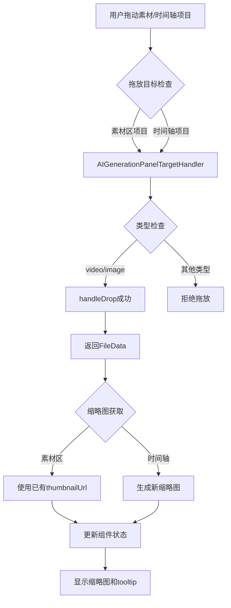

# FileInputField 缩略图显示改造设计方案

## 📋 需求概述

改造 [`FileInputField.vue`](../LightCut-frontend/src/aipanel/components/aigenerate/fields/FileInputField.vue) 组件，使其支持：
1. 从素材区或时间轴拖动项目到此处
2. 支持图片和视频类型
3. 显示缩略图
4. 使用 n-tooltip 展示详细文件信息

## 🎯 设计目标

- **复用现有机制**：利用已有的拖放系统和缩略图生成工具
- **性能优化**：素材区使用已有缩略图，时间轴项目按需生成
- **用户体验**：提供清晰的视觉反馈和详细信息展示
- **类型安全**：确保只接受图片和视频类型

## 📐 架构设计

### 1. 数据流程图



### 2. 组件结构设计

```
FileInputField.vue
├── 拖放区域 (drop-zone)
│   ├── 空状态显示
│   │   ├── 上传图标
│   │   └── 提示文本
│   └── 已选文件显示（使用 n-tooltip 包裹）
│       ├── 缩略图预览 (file-preview)
│       │   ├──  显示缩略图
│       │   └── 加载状态占位符
│       └── 移除按钮
└── tooltip 详细信息展示
    ├── 文件名
    ├── 类型
    ├── 时长
    ├── 分辨率
    └── 来源信息
```

**设计说明**：
- 移除了 file-info 区域，界面更简洁
- 所有文件信息通过 tooltip 展示
- 缩略图作为主要视觉元素
- 移除按钮悬浮在缩略图右上角

## 🔧 技术实现方案

### 3. FileData 接口扩展

```typescript
interface FileData {
  name: string
  mediaType: 'video' | 'image' | 'audio'
  mediaItemId?: string // 来自素材库
  timelineItemId?: string // 来自时间轴
  duration?: number // 时长（帧数）
  
  // 新增字段
  resolution?: { // 分辨率信息
    width: number
    height: number
  }
  
  // 时间轴项目特有
  timeRange?: {
    clipStartTime: number
    clipEndTime: number
    timelineStartTime: number
    timelineEndTime: number
  }
  
  // 来源标识
  source: 'media-item' | 'timeline-item'
}
```

**设计说明**：
- `thumbnailUrl` 不包含在 `FileData` 中，因为它是 UI 层的展示状态，不是业务数据
- 缩略图 URL 由组件内部管理，根据 `FileData` 动态生成和维护

### 4. AIGenerationPanelTargetHandler 改造

**位置**: [`AIGenerationPanelTargetHandler.ts`](../LightCut-frontend/src/core/drag/targets/AIGenerationPanelTargetHandler.ts)

#### 4.1 素材项目处理增强

```typescript
private async handleMediaItemDrop(
  mediaData: MediaItemDragData,
  targetInfo: AIGenerationPanelDropTargetInfo,
): Promise<DropResult> {
  const mediaItem = this.mediaModule.getMediaItem(mediaData.mediaItemId)
  if (!mediaItem) {
    return { success: false }
  }

  // 提取文件信息
  const fileData = {
    name: mediaItem.name,
    mediaType: mediaItem.mediaType,
    mediaItemId: mediaItem.id,
    duration: mediaItem.duration,
    
    // 新增：分辨率信息
    resolution: mediaItem.runtime.bunny?.originalWidth ? {
      width: mediaItem.runtime.bunny.originalWidth,
      height: mediaItem.runtime.bunny.originalHeight,
    } : undefined,
    
    // 新增：来源标识
    source: 'media-item' as const,
  }

  return {
    success: true,
    data: fileData,
  }
}
```

#### 4.2 时间轴项目处理增强

```typescript
private async handleTimelineItemDrop(
  timelineData: TimelineItemDragData,
  targetInfo: AIGenerationPanelDropTargetInfo,
): Promise<DropResult> {
  const timelineItem = this.timelineModule.getTimelineItem(timelineData.itemId)
  const mediaItem = this.mediaModule.getMediaItem(timelineItem.mediaItemId)
  
  if (!timelineItem || !mediaItem) {
    return { success: false }
  }

  const fileData = {
    name: mediaItem.name,
    mediaType: timelineItem.mediaType,
    timelineItemId: timelineItem.id,
    mediaItemId: mediaItem.id,
    duration: timelineItem.timeRange.timelineEndTime - timelineItem.timeRange.timelineStartTime,
    
    // 新增：分辨率信息
    resolution: mediaItem.runtime.bunny?.originalWidth ? {
      width: mediaItem.runtime.bunny.originalWidth,
      height: mediaItem.runtime.bunny.originalHeight,
    } : undefined,
    
    // 时间轴特有信息
    timeRange: {
      clipStartTime: timelineItem.timeRange.clipStartTime,
      clipEndTime: timelineItem.timeRange.clipEndTime,
      timelineStartTime: timelineItem.timeRange.timelineStartTime,
      timelineEndTime: timelineItem.timeRange.timelineEndTime,
    },
    
    // 新增：来源标识
    source: 'timeline-item' as const,
  }

  return {
    success: true,
    data: fileData,
  }
}
```


### 5. FileInputField.vue 组件改造

#### 5.1 模板结构更新

```vue
<template>
  <div class="file-input-field">
    <label class="field-label">
      {{ config.label[locale] }}
    </label>
    
    <div
      class="drop-zone"
      :class="dropZoneClasses"
      @dragover="handleDragOver"
      @dragleave="handleDragLeave"
      @drop="handleDrop"
    >
      <!-- 无文件状态 -->
      <div v-if="!fileData" class="drop-zone-empty">
        <component :is="IconComponents.UPLOAD" size="32px" />
        <p class="drop-hint">
          {{ getPlaceholder() }}
        </p>
        <p v-if="errorMessage" class="error-message">
          {{ errorMessage }}
        </p>
      </div>
      
      <!-- 有文件状态 - 使用 n-tooltip 包裹整个区域 -->
      <n-tooltip
        v-else
        :show-arrow="true"
        placement="right"
        :delay="300"
        trigger="hover"
      >
        <template #trigger>
          <div class="drop-zone-filled">
            <div class="file-preview">
              <!-- 缩略图加载中 -->
              <div v-if="thumbnailLoading" class="thumbnail-loading">
                <component :is="IconComponents.LOADING" size="24px" spin />
              </div>
              <!-- 显示缩略图（仅视频和图片） -->
              
              <!-- 音频或无缩略图时显示图标 -->
              <component v-else :is="getFileIcon()" size="48px" />
              
              <!-- 移除按钮悬浮在右上角 -->
              <button class="remove-button" @click.stop="handleRemove">
                <component :is="IconComponents.CLOSE" size="16px" />
              </button>
            </div>
          </div>
        </template>
        
        <!-- Tooltip 内容 -->
        <div class="tooltip-content">
          <div class="tooltip-title">
            {{ getSourceIcon() }} {{ fileData.name }}
          </div>
          
          <div class="tooltip-detail">
            <div class="tooltip-detail-line">
              类型：{{ getMediaTypeLabel() }}
            </div>
            <div v-if="fileData.duration" class="tooltip-detail-line">
              时长：{{ formatDuration(fileData.duration) }}
            </div>
            <div v-if="fileData.resolution" class="tooltip-detail-line">
              分辨率：{{ fileData.resolution.width }}x{{ fileData.resolution.height }}
            </div>
            <div v-if="fileData.timeRange" class="tooltip-detail-line">
              片段范围：{{ formatTimeRange() }}
            </div>
          </div>
          
          <div class="tooltip-hint">
            💡 来源：{{ fileData.source === 'media-item' ? '素材区' : '时间轴' }}
          </div>
        </div>
      </n-tooltip>
    </div>
  </div>
</template>
```

**关键变化**：
- 移除了 `file-info` 区域
- `remove-button` 移到 `file-preview` 内部，作为绝对定位的悬浮按钮
- 使用 `@click.stop` 防止点击移除按钮时触发其他事件
- 简化了布局结构，只保留缩略图和移除按钮

#### 5.2 脚本逻辑更新

```typescript
<script setup lang="ts">
import { ref, computed, watch, onUnmounted } from 'vue'
import { NTooltip } from 'naive-ui'
import type { FileInputConfig } from '@/core/datasource/providers/ai-generation/types'
import { IconComponents } from '@/constants/iconComponents'
import { useUnifiedStore } from '@/core/unifiedStore'
import { DropTargetType, type AIGenerationPanelDropTargetInfo } from '@/core/types/drag'
import { framesToTimecode } from '@/core/utils/timeUtils'

interface FileData {
  name: string
  mediaType: 'video' | 'image' | 'audio'
  mediaItemId?: string
  timelineItemId?: string
  duration?: number
  resolution?: {
    width: number
    height: number
  }
  timeRange?: {
    clipStartTime: number
    clipEndTime: number
    timelineStartTime: number
    timelineEndTime: number
  }
  source: 'media-item' | 'timeline-item'
}

// ... Props 和 Emits 定义保持不变 ...

const unifiedStore = useUnifiedStore()
const mediaModule = unifiedStore.mediaModule
const timelineModule = unifiedStore.timelineModule

const dragState = ref<'idle' | 'accept' | 'reject'>('idle')
const fileData = ref<FileData | null>(null)
const errorMessage = ref<string | null>(null)

// 缩略图 URL（组件内部状态，不属于 FileData）
const thumbnailUrl = ref<string | null>(null)
const thumbnailLoading = ref(false)

// 缩略图URL（计算属性）
const previewUrl = computed(() => {
  // 音频类型不显示缩略图
  if (fileData.value?.mediaType === 'audio') {
    return null
  }
  return thumbnailUrl.value
})

// 加载缩略图
const loadThumbnail = async (data: FileData) => {
  // 在加载新缩略图前，清理旧的时间轴视频 Blob URL
  if (fileData.value?.source === 'timeline-item' &&
      fileData.value?.mediaType === 'video' &&
      thumbnailUrl.value?.startsWith('blob:')) {
    console.log('加载新缩略图前清理旧的 Blob URL:', thumbnailUrl.value)
    URL.revokeObjectURL(thumbnailUrl.value)
  }
  
  thumbnailLoading.value = true
  thumbnailUrl.value = null
  
  try {
    if (data.mediaType === 'audio') {
      // 音频不需要缩略图
      return
    }
    
    const mediaItem = mediaModule.getMediaItem(data.mediaItemId!)
    if (!mediaItem) {
      console.error('找不到 mediaItem:', data.mediaItemId)
      return
    }
    
    if (data.source === 'media-item') {
      // 素材区：直接使用已有缩略图
      thumbnailUrl.value = mediaItem.runtime.bunny?.thumbnailUrl || null
    } else if (data.source === 'timeline-item') {
      if (data.mediaType === 'video') {
        // 时间轴视频：生成新缩略图
        const { generateThumbnailForUnifiedMediaItemBunny } = await import(
          '@/core/bunnyUtils/thumbGenerator'
        )
        
        const timelineItem = timelineModule.getTimelineItem(data.timelineItemId!)
        if (!timelineItem) {
          console.error('找不到 timelineItem:', data.timelineItemId)
          return
        }
        
        const { clipStartTime, clipEndTime } = timelineItem.timeRange
        const thumbnailTimePosition = Math.floor((clipStartTime + clipEndTime) / 2)
        const timePositionUs = thumbnailTimePosition / 30
        
        thumbnailUrl.value = await generateThumbnailForUnifiedMediaItemBunny(
          mediaItem,
          timePositionUs,
          80,
          80,
        )
      } else if (data.mediaType === 'image') {
        // 时间轴图片：使用已有缩略图
        thumbnailUrl.value = mediaItem.runtime.bunny?.thumbnailUrl || null
      }
    }
  } catch (error) {
    console.error('加载缩略图失败:', error)
  } finally {
    thumbnailLoading.value = false
  }
}

// 处理拖拽放置
const handleDrop = async (event: DragEvent) => {
  event.preventDefault()
  event.stopPropagation()
  dragState.value = 'idle'
  
  const targetInfo: AIGenerationPanelDropTargetInfo = {
    targetType: DropTargetType.AI_GENERATION_PANEL,
    fieldConfig: props.config,
  }
  
  const result = await unifiedStore.handleDrop(event, targetInfo)
  
  if (result.success && result.data) {
    fileData.value = result.data
    emit('update:modelValue', result.data)
    errorMessage.value = null
    
    // 根据 fileData 加载缩略图
    await loadThumbnail(result.data)
    
    unifiedStore.messageSuccess(`已添加文件: ${result.data.name}`)
  } else {
    errorMessage.value = '文件拖拽失败，请重试'
    unifiedStore.messageError('文件拖拽失败，请重试')
  }
}

// 处理移除文件
const handleRemove = () => {
  // 清理时间轴视频的 Blob URL
  if (fileData.value?.source === 'timeline-item' &&
      fileData.value?.mediaType === 'video' &&
      thumbnailUrl.value?.startsWith('blob:')) {
    console.log('移除文件时清理 Blob URL:', thumbnailUrl.value)
    URL.revokeObjectURL(thumbnailUrl.value)
  }
  
  fileData.value = null
  thumbnailUrl.value = null
  emit('update:modelValue', null)
}

// 格式化时长
const formatDuration = (frames: number): string => {
  return framesToTimecode(frames)
}

// 格式化时间范围
const formatTimeRange = (): string => {
  if (!fileData.value?.timeRange) return ''
  const { clipStartTime, clipEndTime } = fileData.value.timeRange
  return `${framesToTimecode(clipStartTime)} - ${framesToTimecode(clipEndTime)}`
}

// 获取媒体类型标签
const getMediaTypeLabel = (): string => {
  if (!fileData.value) return ''
  const typeMap = {
    video: '视频',
    image: '图片',
    audio: '音频',
  }
  return typeMap[fileData.value.mediaType] || '未知'
}

// 获取来源图标
const getSourceIcon = (): string => {
  if (!fileData.value) return '📦'
  return fileData.value.source === 'media-item' ? '📦' : '🎬'
}

// 组件卸载时清理资源
onUnmounted(() => {
  // 清理时间轴视频的 Blob URL
  if (fileData.value?.source === 'timeline-item' &&
      fileData.value?.mediaType === 'video' &&
      thumbnailUrl.value?.startsWith('blob:')) {
    console.log('组件卸载时清理 Blob URL:', thumbnailUrl.value)
    URL.revokeObjectURL(thumbnailUrl.value)
  }
})

// ... 其他方法保持不变 ...
</script>
```

#### 5.3 样式更新

```css
<style scoped>
/* 基础样式 */
.file-input-field {
  display: flex;
  flex-direction: column;
  gap: var(--spacing-xs);
}

.field-label {
  font-size: var(--font-size-sm);
  color: var(--color-text-secondary);
  font-weight: 500;
}

.drop-zone {
  min-height: 120px;
  border: 2px dashed var(--color-border-secondary);
  border-radius: var(--border-radius-small);
  background: var(--color-bg-quaternary);
  transition: all 0.2s ease;
  cursor: pointer;
}

.drop-zone.drag-accept {
  border-color: var(--color-accent-primary);
  background: var(--color-accent-bg);
}

.drop-zone.drag-reject {
  border-color: var(--color-error);
  background: var(--color-error-bg);
}

.drop-zone-empty {
  display: flex;
  flex-direction: column;
  align-items: center;
  justify-content: center;
  height: 100%;
  min-height: 120px;
  padding: var(--spacing-lg);
  color: var(--color-text-hint);
}

.drop-hint {
  margin-top: var(--spacing-sm);
  font-size: var(--font-size-sm);
  text-align: center;
}

.error-message {
  margin-top: var(--spacing-xs);
  font-size: var(--font-size-xs);
  color: var(--color-error);
  text-align: center;
}

/* 已选文件状态 - 简化布局，只显示缩略图 */
.drop-zone-filled {
  display: flex;
  align-items: center;
  justify-content: center;
  padding: var(--spacing-md);
  min-height: 120px;
}

/* 缩略图容器 - 相对定位以容纳移除按钮 */
.file-preview {
  width: 80px;
  height: 80px;
  border-radius: var(--border-radius-small);
  overflow: hidden;
  background: var(--color-bg-secondary);
  display: flex;
  align-items: center;
  justify-content: center;
  flex-shrink: 0;
  position: relative;
}

.file-preview img {
  width: 100%;
  height: 100%;
  object-fit: cover;
}

/* 缩略图加载状态 */
.thumbnail-loading {
  width: 100%;
  height: 100%;
  display: flex;
  align-items: center;
  justify-content: center;
  background: var(--color-bg-secondary);
  color: var(--color-text-hint);
}

/* 移除按钮 - 悬浮在右上角 */
.remove-button {
  position: absolute;
  top: 4px;
  right: 4px;
  padding: 4px;
  background: rgba(0, 0, 0, 0.6);
  border: none;
  border-radius: var(--border-radius-small);
  cursor: pointer;
  color: white;
  transition: all 0.2s ease;
  display: flex;
  align-items: center;
  justify-content: center;
  opacity: 0;
  z-index: 10;
}

/* 悬停时显示移除按钮 */
.file-preview:hover .remove-button {
  opacity: 1;
}

.remove-button:hover {
  background: var(--color-error);
  transform: scale(1.1);
}

/* Tooltip 内容样式 */
.tooltip-content {
  padding: 8px 12px;
  max-width: 300px;
  font-size: 13px;
  line-height: 1.6;
}

.tooltip-title {
  font-weight: 600;
  margin-bottom: 6px;
  color: var(--n-text-color);
  font-size: 14px;
}

.tooltip-detail {
  color: var(--n-text-color-2);
  font-size: 12px;
  margin-top: 4px;
}

.tooltip-detail-line {
  line-height: 1.5;
}

.tooltip-hint {
  color: var(--n-info-color);
  font-size: 12px;
  margin-top: 6px;
  padding-top: 6px;
  border-top: 1px solid var(--n-divider-color);
}
</style>
```

## 🔄 实现流程

### 阶段1：数据层改造
1. 更新 [`FileData`](../LightCut-frontend/src/aipanel/components/aigenerate/fields/FileInputField.vue:50-63) 接口定义
2. 修改 [`AIGenerationPanelTargetHandler`](../LightCut-frontend/src/core/drag/targets/AIGenerationPanelTargetHandler.ts) 的 drop 处理逻辑
3. 添加缩略图生成方法

### 阶段2：UI层改造
1. 引入 `n-tooltip` 组件
2. 更新模板结构，添加缩略图显示和 tooltip
3. 实现缩略图加载状态管理
4. 添加格式化工具方法

### 阶段3：样式优化
1. 调整缩略图容器样式
2. 添加加载状态样式
3. 优化 tooltip 样式

### 阶段4：测试验证
1. 测试素材区拖放（使用已有缩略图）
2. 测试时间轴拖放（生成新缩略图）
3. 测试不同媒体类型（视频、图片）
4. 测试 tooltip 信息展示
5. 测试错误处理

## 📊 性能考虑

### 缩略图获取策略

| 来源 | 媒体类型 | 策略 | 说明 |
|------|---------|------|------|
| 素材区 | 视频 | 使用已有缩略图 | `mediaItem.runtime.bunny.thumbnailUrl` |
| 素材区 | 图片 | 使用已有缩略图 | `mediaItem.runtime.bunny.thumbnailUrl` |
| 素材区 | 音频 | 使用图标 | `IconComponents.MUSIC` |
| 时间轴 | 视频 | 生成新缩略图 | 基于片段中间位置生成 |
| 时间轴 | 图片 | 使用已有缩略图 | 图片不受时间范围影响，直接使用 `mediaItem.runtime.bunny.thumbnailUrl` |
| 时间轴 | 音频 | 使用图标 | `IconComponents.MUSIC` |

**性能优化要点**：
- **素材区**：所有类型都直接使用已有资源（HTTP URL），零额外开销
- **时间轴视频**：生成新的 Blob URL 缩略图，使用 [`generateThumbnailForUnifiedMediaItemBunny`](../LightCut-frontend/src/core/bunnyUtils/thumbGenerator.ts:210-272)
- **时间轴图片**：直接使用素材区缩略图（HTTP URL），图片是静态的不需要生成新缩略图
- **时间轴音频**：使用图标，无需任何处理
- **缓存策略**：生成的缩略图 URL 保存在 `FileData` 中，避免重复生成

### 内存管理 - Blob URL 清理策略

**关键原则**：只清理时间轴视频生成的 Blob URL

**⚠️ 重要说明**：
- **只有时间轴的视频类型**才会生成新的 Blob URL，因此**只有这种情况需要释放**
- 素材区的图片/视频使用的是 HTTP URL（由服务器管理），**不需要释放**
- 时间轴的图片直接使用素材区的 HTTP URL，**不需要释放**

| 来源 | 媒体类型 | 缩略图来源 | 是否清理 | 原因 |
|------|---------|-----------|---------|------|
| 素材区 | 图片 | HTTP URL | ❌ 不清理 | 服务器管理的 URL |
| 素材区 | 视频 | HTTP URL | ❌ 不清理 | 服务器管理的 URL |
| 时间轴 | 图片 | HTTP URL | ❌ 不清理 | 复用素材区的 HTTP URL |
| 时间轴 | 视频 | Blob URL（新生成）| ✅ **需要清理** | 本地生成的临时 URL |

**实现方式**：

```typescript
// 缩略图 URL 作为组件内部状态
const thumbnailUrl = ref<string | null>(null)

// 1. 在 loadThumbnail 中清理旧的时间轴视频 Blob URL
const loadThumbnail = async (data: FileData) => {
  // 在加载新缩略图前，清理旧的时间轴视频 Blob URL
  if (fileData.value?.source === 'timeline-item' &&
      fileData.value?.mediaType === 'video' &&
      thumbnailUrl.value?.startsWith('blob:')) {
    URL.revokeObjectURL(thumbnailUrl.value)
  }
  
  thumbnailLoading.value = true
  thumbnailUrl.value = null
  
  // ... 加载缩略图逻辑
}

// 2. 移除文件时清理
const handleRemove = () => {
  if (fileData.value?.source === 'timeline-item' &&
      fileData.value?.mediaType === 'video' &&
      thumbnailUrl.value?.startsWith('blob:')) {
    URL.revokeObjectURL(thumbnailUrl.value)
  }
  fileData.value = null
  thumbnailUrl.value = null
}

// 3. 组件卸载时清理
onUnmounted(() => {
  if (fileData.value?.source === 'timeline-item' &&
      fileData.value?.mediaType === 'video' &&
      thumbnailUrl.value?.startsWith('blob:')) {
    URL.revokeObjectURL(thumbnailUrl.value)
  }
})
```

**为什么这样设计**：
- **素材区的图片/视频**：使用 HTTP URL（`mediaItem.runtime.bunny?.thumbnailUrl`），由服务器管理，不需要清理
- **时间轴的图片**：直接使用素材区的 HTTP URL（`mediaItem.runtime.bunny?.thumbnailUrl`），不生成新的 Blob URL，不需要清理
- **时间轴的视频**：使用 `generateThumbnailForUnifiedMediaItemBunny` 生成新的 Blob URL（显示片段中间位置的帧），必须清理以避免内存泄漏

**清理时机**：
1. 在 `loadThumbnail` 开始时（加载新缩略图前）
2. 用户点击移除按钮时
3. 组件卸载时

**判断条件**（三个条件必须同时满足）：
```typescript
fileData.value?.source === 'timeline-item' &&
fileData.value?.mediaType === 'video' &&
thumbnailUrl.value?.startsWith('blob:')
```

## 🎯 关键设计决策

### 缩略图 URL 的存储位置

**决策**：缩略图 URL 不存储在 `FileData` 中，而是作为组件内部的独立状态。

**理由**：
1. **职责分离**：`FileData` 是业务数据，描述文件本身的属性；缩略图 URL 是 UI 展示状态
2. **生命周期管理**：缩略图 URL（特别是 Blob URL）需要组件级别的生命周期管理
3. **灵活性**：组件可以根据 `FileData` 动态加载、更新或清理缩略图，而不影响业务数据
4. **清晰的数据流**：
   - `FileData`：从拖放系统获取 → 传递给父组件（业务逻辑）
   - `thumbnailUrl`：组件内部根据 `FileData` 生成 → 仅用于 UI 展示

**实现方式**：参见第 374-434 行的 `loadThumbnail` 方法实现。

## 🎨 用户体验增强

### 视觉反馈
1. **拖放状态**：保持现有的 `drag-accept` 和 `drag-reject` 样式
2. **加载状态**：显示旋转的加载图标
3. **错误状态**：缩略图加载失败时回退到类型图标

### 信息展示
1. **基本信息**：文件名、类型、时长、分辨率
2. **来源标识**：清楚标识来自素材区还是时间轴
3. **时间范围**：时间轴项目显示片段的时间范围

## 🔍 类型安全

### 类型守卫
```typescript
// 在 handleDrop 中添加类型检查
if (result.data.mediaType !== 'video' && result.data.mediaType !== 'image') {
  errorMessage.value = '仅支持视频和图片类型'
  return
}
```

### 配置验证
```typescript
// 在 handleDragOver 中验证 accept 配置
const acceptTypes = props.config.accept || []
if (acceptTypes.length > 0 && 
    !acceptTypes.includes('video') && 
    !acceptTypes.includes('image')) {
  console.warn('FileInputField 配置的 accept 类型不包含 video 或 image')
}
```

## 📝 实施状态

- [x] 更新 FileData 接口定义
- [x] 修改 AIGenerationPanelTargetHandler
  - [x] 增强 handleMediaItemDrop
  - [x] 增强 handleTimelineItemDrop
  - [x] 添加 generateTimelineItemThumbnail 方法
- [x] 改造 FileInputField.vue
  - [x] 引入 n-tooltip 组件
  - [x] 更新模板结构
  - [x] 添加缩略图加载逻辑
  - [x] 实现格式化方法
  - [x] 添加资源清理逻辑（精确清理时间轴视频 Blob URL）
- [x] 样式优化
- [x] 测试验证

## ✅ 实施总结

### 已完成功能
1. ✅ 支持从素材区和时间轴拖放图片/视频
2. ✅ 显示缩略图预览
3. ✅ 使用 n-tooltip 展示详细信息
4. ✅ 精确的 Blob URL 清理策略
5. ✅ 完整的错误处理和加载状态

### 关键技术决策
1. **Blob URL 清理**：只清理时间轴视频生成的 Blob URL，避免误清理
2. **时间轴图片处理**：优先使用已有 URL，没有则生成，提高性能
3. **计算属性 previewUrl**：简化模板逻辑，统一缩略图 URL 获取
4. **watch fileData**：监听整个 fileData 对象，精确判断清理时机

## 🚀 后续优化方向

1. **缩略图预加载**：在拖放悬停时预加载缩略图
2. **缩略图缓存**：实现全局缩略图缓存机制
3. **自定义时间点**：允许用户选择缩略图的时间点
4. **批量拖放**：支持同时拖放多个文件
5. **拖放动画**：添加更流畅的拖放动画效果

## 📚 参考资料

- [`MediaItemThumbnail.vue`](../LightCut-frontend/src/components/panels/MediaItemThumbnail.vue) - 缩略图显示参考
- [`thumbGenerator.ts`](../LightCut-frontend/src/core/bunnyUtils/thumbGenerator.ts) - 缩略图生成工具
- [`AIGenerationPanelTargetHandler.ts`](../LightCut-frontend/src/core/drag/targets/AIGenerationPanelTargetHandler.ts) - 拖放处理器
- [Naive UI Tooltip](https://www.naiveui.com/zh-CN/os-theme/components/tooltip) - Tooltip 组件文档