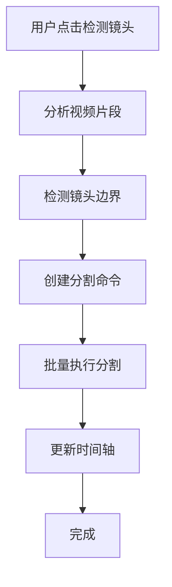

# LightCut 简化版镜头检测实现方案

## 一、核心理念

**简化目标**：
- 一键检测镜头边界
- 自动创建分割点
- 最小配置，开箱即用
- 创建新的多分割点命令

**技术策略**：
- 参考 `SplitTimelineItemCommand` 创建新的 `MultiSplitTimelineItemCommand`
- 创建一个简单的检测服务来识别镜头边界
- 集成到现有的时间轴系统，无需大幅修改架构

## 二、简化架构设计

### 2.1 整体流程



### 2.2 核心组件

1. **useShotDetection** - 镜头检测组合式函数
2. **SimpleShotDetector** - 简化的两阶段检测器
3. **MultiSplitTimelineItemCommand** - 多分割点命令
4. **UI集成** - 右键菜单和工具栏按钮

## 三、核心实现

### 3.1 镜头边界检测器（简化版）

```typescript
// src/core/shotdetection/SimpleShotDetector.ts
export class SimpleShotDetector {
  private readonly DEFAULT_STEP = 10 // 抽帧步长
  private readonly DEFAULT_THRESHOLD = 0.3 // 检测阈值
  
  async detectShotBoundaries(
    bunnyClip: BunnyClip,
    progressCallback?: (progress: number) => void
  ): Promise<number[]> {
    const boundaries: number[] = []
    const totalFrames = Number(bunnyClip.duration)
    
    let prevHistogram: Uint32Array | null = null
    let processedFrames = 0
    
    // 阶段1：粗检测 - 每STEP帧检测一次
    for (let frame = 0; frame < totalFrames; frame += this.DEFAULT_STEP) {
      // 使用 MediaBunny 的 tickN 方法
      const result = await bunnyClip.tickN(BigInt(frame), false, true)
      // tickN 返回: { audio: WrappedAudioBuffer[], video: VideoSample | null, state: 'success' | 'outofrange' | 'skip' }
      
      if (result.state === 'success' && result.video) {
        const videoFrame = result.video.toVideoFrame()
        result.video.close() // 立即释放 VideoSample 资源
        
        const histogram = this.computeSimpleHistogram(videoFrame)
        
        if (prevHistogram) {
          const diff = this.histogramDifference(prevHistogram, histogram)
          
          if (diff > this.DEFAULT_THRESHOLD) {
            // 找到疑似边界，记录区间开始
            boundaries.push(Math.max(0, frame - this.DEFAULT_STEP))
          }
        }
        
        prevHistogram = histogram
        videoFrame.close() // 释放 VideoFrame 资源
      }
      
      processedFrames += this.DEFAULT_STEP
      progressCallback?.(processedFrames / totalFrames * 0.5) // 粗检测占50%进度
    }
    
    // 阶段2：精检测 - 在疑似区间内逐帧检测
    const refinedBoundaries: number[] = []
    const totalCandidates = boundaries.length
    
    for (let i = 0; i < boundaries.length; i++) {
      const candidateStart = boundaries[i]
      const candidateEnd = Math.min(candidateStart + this.DEFAULT_STEP, totalFrames)
      
      let maxDiff = 0
      let bestFrame = candidateStart
      
      // 在[Math.max(0, candidateStart-DEFAULT_STEP), candidateEnd]区间内逐帧检测
      const searchStart = Math.max(0, candidateStart - this.DEFAULT_STEP)
      let prevHistogram2: Uint32Array | null = null // 精检测阶段保存前一帧直方图，避免重复解码
      
      for (let frame = searchStart; frame < candidateEnd; frame++) {
        const result = await bunnyClip.tickN(BigInt(frame), false, true)
        // tickN 返回: { audio: WrappedAudioBuffer[], video: VideoSample | null, state: 'success' | 'outofrange' | 'skip' }
        
        if (result.state === 'success' && result.video) {
          const videoFrame = result.video.toVideoFrame()
          result.video.close() // 立即释放 VideoSample 资源
          
          const histogram = this.computeSimpleHistogram(videoFrame)
          
          // 使用保存的前一帧直方图进行比较，避免重复解码
          if (prevHistogram2) {
            const diff = this.histogramDifference(prevHistogram2, histogram)
            
            if (diff > maxDiff) {
              maxDiff = diff
              bestFrame = frame
            }
          }
          
          prevHistogram2 = histogram // 保存当前帧作为下一帧的前一帧
          videoFrame.close() // 释放当前帧 VideoFrame 资源
        }
      }
      
      if (maxDiff > this.DEFAULT_THRESHOLD * 1.5) { // 精检测使用更高阈值
        refinedBoundaries.push(bestFrame)
      }
      
      progressCallback?.(0.5 + (i + 1) / totalCandidates * 0.5) // 精检测占50%进度
    }
    
    return refinedBoundaries.sort((a, b) => a - b)
  }
  
  private computeSimpleHistogram(videoFrame: VideoFrame): Uint32Array {
    const originalWidth = videoFrame.displayWidth
    const originalHeight = videoFrame.displayHeight
    
    // 性能优化：统一缩放到长边640像素
    const MAX_SIZE = 640 // 最大处理尺寸
    let width = originalWidth
    let height = originalHeight
    
    // 如果视频长边大于640，按比例缩小到长边640
    if (Math.max(originalWidth, originalHeight) > MAX_SIZE) {
      const scale = MAX_SIZE / Math.max(originalWidth, originalHeight)
      width = Math.round(originalWidth * scale)
      height = Math.round(originalHeight * scale)
    }
    
    const histogram = new Uint32Array(64) // 简化为64个bin的灰度直方图
    
    const canvas = new OffscreenCanvas(width, height)
    const ctx = canvas.getContext('2d')!
    
    // 如果需要缩放，使用更快的缩放算法
    ctx.imageSmoothingEnabled = false // 关闭抗锯齿，提升性能
    ctx.drawImage(videoFrame, 0, 0, width, height)
    
    const imageData = ctx.getImageData(0, 0, width, height)
    const data = imageData.data
    
    // 计算灰度直方图
    for (let i = 0; i < data.length; i += 4) {
      const gray = Math.round(0.299 * data[i] + 0.587 * data[i + 1] + 0.114 * data[i + 2])
      const bin = Math.floor(gray * 63 / 255)
      histogram[bin]++
    }
    
    return histogram
  }
  
  private histogramDifference(hist1: Uint32Array, hist2: Uint32Array): number {
    let sum1 = 0, sum2 = 0
    
    for (let i = 0; i < hist1.length; i++) {
      sum1 += hist1[i]
      sum2 += hist2[i]
    }
    
    // 归一化并计算差异
    let distance = 0
    for (let i = 0; i < hist1.length; i++) {
      const diff = (hist1[i] / sum1) - (hist2[i] / sum2)
      distance += diff * diff
    }
    
    return Math.sqrt(distance)
  }
}
```

### 3.2 多分割点命令

```typescript
// src/core/modules/commands/MultiSplitTimelineItemCommand.ts
/**
 * 多分割点时间轴项目命令
 * 基于镜头检测结果，一次性将一个时间轴项目分割为多个片段
 */

import { generateCommandId, generateTimelineItemId } from '@/core/utils/idGenerator'
import { framesToTimecode } from '@/core/utils/timeUtils'
import type { SimpleCommand } from '@/core/modules/commands/types'
import { cleanupCommandMediaSync } from '@/core/managers/media'
import { setupTimelineItemBunny } from '@/core/bunnyUtils/timelineItemSetup'
import type { UnifiedTimelineItemData, MediaType } from '@/core/timelineitem/type'
import type { UnifiedMediaItemData } from '@/core/mediaitem/types'
import type { UnifiedTimeRange } from '@/core/types/timeRange'
import type { GetAnimation } from '@/core/timelineitem/bunnytype'
import { TimelineItemFactory } from '@/core/timelineitem'

export class MultiSplitTimelineItemCommand implements SimpleCommand {
  public readonly id: string
  public readonly description: string
  private originalTimelineItemData: UnifiedTimelineItemData<MediaType>
  private splitBoundaryFrames: number[] // 分割边界点（时间轴帧数）
  private createdItemIds: string[] // 创建的所有项目ID
  private _isDisposed = false

  constructor(
    private originalTimelineItemId: string,
    originalTimelineItem: UnifiedTimelineItemData<MediaType>,
    splitBoundaryFrames: number[], // 分割边界点（时间轴帧数）
    private timelineModule: {
      addTimelineItem: (item: UnifiedTimelineItemData<MediaType>) => Promise<void>
      removeTimelineItem: (id: string) => void
      getTimelineItem: (id: string) => UnifiedTimelineItemData<MediaType> | undefined
    },
    private mediaModule: {
      getMediaItem: (id: string) => UnifiedMediaItemData | undefined
    },
  ) {
    this.id = generateCommandId()
    this.splitBoundaryFrames = splitBoundaryFrames.sort((a, b) => a - b) // 按时间正序
    this.createdItemIds = []

    const mediaItem = this.mediaModule.getMediaItem(originalTimelineItem.mediaItemId)
    this.description = `智能分镜头: ${mediaItem?.name || '未知素材'} (${splitBoundaryFrames.length}个分割点)`

    // 保存原始项目的完整重建元数据
    this.originalTimelineItemData = TimelineItemFactory.clone(originalTimelineItem)

    console.log('💾 保存多分割项目的重建数据:', {
      originalId: this.originalTimelineItemData.id,
      mediaItemId: this.originalTimelineItemData.mediaItemId,
      splitBoundaryFrames: this.splitBoundaryFrames,
    })
  }

  /**
   * 从原始素材重建所有分割后的片段
   */
  private async rebuildSplitItems(): Promise<UnifiedTimelineItemData<MediaType>[]> {
    console.log('🔄 开始从源头重建多分割时间轴项目...')

    const splitItems: UnifiedTimelineItemData<MediaType>[] = []
    const boundaries = [0, ...this.splitBoundaryFrames, this.originalTimelineItemData.timeRange.timelineEndTime]

    for (let i = 0; i < boundaries.length - 1; i++) {
      const startTime = boundaries[i]
      const endTime = boundaries[i + 1]
      
      const newItemId = generateTimelineItemId()
      this.createdItemIds.push(newItemId)

      // 计算在素材中的相对位置
      const originalTimeRange = this.originalTimelineItemData.timeRange
      const timelineDuration = originalTimeRange.timelineEndTime - originalTimeRange.timelineStartTime
      const clipDuration = originalTimeRange.clipEndTime - originalTimeRange.clipStartTime

      const startRatio = (startTime - originalTimeRange.timelineStartTime) / timelineDuration
      const endRatio = (endTime - originalTimeRange.timelineStartTime) / timelineDuration

      const clipStartTime = originalTimeRange.clipStartTime + Math.round(clipDuration * startRatio)
      const clipEndTime = originalTimeRange.clipStartTime + Math.round(clipDuration * endRatio)

      // 创建新片段的时间范围
      const newTimeRange: UnifiedTimeRange = {
        clipStartTime,
        clipEndTime,
        timelineStartTime: startTime,
        timelineEndTime: endTime,
      }

      // 处理关键帧动画
      let newAnimation: GetAnimation<MediaType> | undefined
      if (this.originalTimelineItemData.animation && this.originalTimelineItemData.animation.keyframes.length > 0) {
        // 这里可以添加关键帧分割逻辑，暂时简化处理
        newAnimation = { keyframes: [] }
      }

      // 使用 TimelineItemFactory.rebuildForCmd 创建新片段
      const rebuildResult = await TimelineItemFactory.rebuildForCmd({
        originalTimelineItemData: {
          ...this.originalTimelineItemData,
          id: newItemId,
          timeRange: newTimeRange,
          animation: newAnimation,
        },
        getMediaItem: this.mediaModule.getMediaItem,
        logIdentifier: `MultiSplitTimelineItemCommand rebuildSplitItems segment ${i}`,
      })

      if (!rebuildResult.success) {
        throw new Error(`重建分割片段 ${i} 失败: ${rebuildResult.error}`)
      }

      const newItem = rebuildResult.timelineItem
      const newMediaItem = this.mediaModule.getMediaItem(newItem.mediaItemId)
      
      if (!newMediaItem) {
        throw new Error(`找不到关联的媒体项目: ${newItem.mediaItemId}`)
      }

      // 创建 bunny 对象
      await setupTimelineItemBunny(newItem, newMediaItem)
      newItem.timelineStatus = 'ready'

      splitItems.push(newItem)
    }

    console.log(`🔄 重建 ${splitItems.length} 个分割项目完成`)
    return splitItems
  }

  /**
   * 执行命令：多分割时间轴项目
   */
  async execute(): Promise<void> {
    try {
      const originalItem = this.timelineModule.getTimelineItem(this.originalTimelineItemId)
      if (!originalItem) {
        console.warn(`⚠️ 原始时间轴项目不存在，无法分割: ${this.originalTimelineItemId}`)
        return
      }

      // 从原始素材重新创建所有分割后的项目
      const splitItems = await this.rebuildSplitItems()

      // 1. 删除原始项目
      await this.timelineModule.removeTimelineItem(this.originalTimelineItemId)

      // 2. 添加所有分割后的项目
      for (const item of splitItems) {
        await this.timelineModule.addTimelineItem(item)
      }

      const mediaItem = this.mediaModule.getMediaItem(this.originalTimelineItemData.mediaItemId)
      console.log(`🔪 已智能分镜头: ${mediaItem?.name || '未知素材'} → ${splitItems.length} 个片段`)
    } catch (error) {
      const mediaItem = this.mediaModule.getMediaItem(this.originalTimelineItemData.mediaItemId)
      console.error(`❌ 智能分镜头失败: ${mediaItem?.name || '未知素材'}`, error)
      throw error
    }
  }

  /**
   * 撤销命令：从原始素材重建原始项目，删除所有分割后的项目
   */
  async undo(): Promise<void> {
    try {
      console.log(`🔄 撤销多分割操作：重建原始时间轴项目...`)

      // 1. 从原始素材重新创建原始项目
      const rebuildResult = await TimelineItemFactory.rebuildForCmd({
        originalTimelineItemData: this.originalTimelineItemData,
        getMediaItem: this.mediaModule.getMediaItem,
        logIdentifier: 'MultiSplitTimelineItemCommand rebuildOriginalItem',
      })

      if (!rebuildResult.success) {
        throw new Error(`重建原始项目失败: ${rebuildResult.error}`)
      }

      const originalItem = rebuildResult.timelineItem
      const originalMediaItem = this.mediaModule.getMediaItem(originalItem.mediaItemId)
      
      if (!originalMediaItem) {
        throw new Error(`找不到关联的媒体项目: ${originalItem.mediaItemId}`)
      }

      // 创建 bunny 对象
      await setupTimelineItemBunny(originalItem, originalMediaItem)
      originalItem.timelineStatus = 'ready'

      // 2. 删除所有分割后的项目
      for (const itemId of this.createdItemIds) {
        await this.timelineModule.removeTimelineItem(itemId)
      }

      // 3. 添加原始项目到时间轴
      await this.timelineModule.addTimelineItem(originalItem)

      const mediaItem = this.mediaModule.getMediaItem(this.originalTimelineItemData.mediaItemId)
      console.log(`↩️ 已撤销智能分镜头: ${mediaItem?.name || '未知素材'}`)
    } catch (error) {
      const mediaItem = this.mediaModule.getMediaItem(this.originalTimelineItemData.mediaItemId)
      console.error(`❌ 撤销智能分镜头失败: ${mediaItem?.name || '未知素材'}`, error)
      throw error
    }
  }

  get isDisposed(): boolean {
    return this._isDisposed
  }

  dispose(): void {
    if (this._isDisposed) {
      return
    }

    this._isDisposed = true
    cleanupCommandMediaSync(this.id)
    console.log(`🗑️ [MultiSplitTimelineItemCommand] 命令资源已清理: ${this.id}`)
  }
}
```

### 3.3 镜头检测组合式函数

```typescript
// src/core/composables/useShotDetection.ts
import { ref } from 'vue'
import type { UnifiedTimelineItemData, MediaType } from '@/core/timelineitem'
import type { UnifiedMediaItemData } from '@/core/mediaitem/types'
import type { SimpleCommand } from '@/core/modules/commands/types'
import type {
  UnifiedTimelineModule,
  UnifiedMediaModule,
  UnifiedHistoryModule,
  UnifiedConfigModule,
} from '@/core/modules'
import { SimpleShotDetector } from '@/core/shotdetection/SimpleShotDetector'
import { MultiSplitTimelineItemCommand } from '@/core/modules/commands/MultiSplitTimelineItemCommand'

/**
 * 镜头检测组合式函数返回接口
 */
export interface ShotDetectionComposable {
  // 核心检测方法
  detectAndSplitShots(
    timelineItemId: string,
    progressCallback?: (progress: number, stage: string) => void
  ): Promise<{ success: boolean; splitCount: number; error?: string }>
  
  // 便捷方法：仅检测边界，不执行分割
  detectShotBoundaries(
    timelineItemId: string,
    progressCallback?: (progress: number) => void
  ): Promise<number[]>
  
  // 响应式状态
  isDetecting: Ref<boolean>
  detectionProgress: Ref<number>
  detectionStage: Ref<string>
}

/**
 * 镜头检测组合式函数
 *
 * 提供镜头边界检测和自动分割功能，基于两阶段检测算法
 *
 * @param unifiedTimelineModule - 时间轴模块
 * @param unifiedMediaModule - 媒体模块
 * @param unifiedHistoryModule - 历史记录模块
 * @param unifiedConfigModule - 配置模块
 */
export function useShotDetection(
  unifiedTimelineModule: UnifiedTimelineModule,
  unifiedMediaModule: UnifiedMediaModule,
  unifiedHistoryModule: UnifiedHistoryModule,
  unifiedConfigModule: UnifiedConfigModule,
): ShotDetectionComposable {
  // 响应式状态
  const isDetecting = ref(false)
  const detectionProgress = ref(0)
  const detectionStage = ref('')
  
  /**
   * 检测镜头边界并自动分割
   */
  async function detectAndSplitShots(
    timelineItemId: string,
    progressCallback?: (progress: number, stage: string) => void
  ): Promise<{ success: boolean; splitCount: number; error?: string }> {
    try {
      isDetecting.value = true
      detectionProgress.value = 0
      detectionStage.value = '获取时间轴项目'
      progressCallback?.(0, '获取时间轴项目')
      
      // 获取时间轴项目
      const timelineItem = unifiedTimelineModule.getTimelineItem(timelineItemId)
      if (!timelineItem) {
        return { success: false, splitCount: 0, error: '时间轴项目不存在' }
      }
      
      // 获取媒体项目
      const mediaItem = unifiedMediaModule.getMediaItem(timelineItem.mediaItemId)
      if (!mediaItem) {
        return { success: false, splitCount: 0, error: '媒体项目不存在' }
      }
      
      if (!mediaItem.runtime.bunny?.bunnyMedia?.clip) {
        return { success: false, splitCount: 0, error: '媒体项目未准备好' }
      }
      
      detectionStage.value = '检测镜头边界'
      progressCallback?.(0.1, '检测镜头边界')
      
      // 检测镜头边界
      const detector = new SimpleShotDetector()
      const boundaries = await detector.detectShotBoundaries(
        mediaItem.runtime.bunny.bunnyMedia.clip,
        (progress) => {
          const totalProgress = 0.1 + progress * 0.8
          detectionProgress.value = totalProgress
          progressCallback?.(totalProgress, '检测镜头边界')
        }
      )
      
      if (boundaries.length === 0) {
        return { success: true, splitCount: 0, error: '未检测到镜头边界' }
      }
      
      detectionStage.value = '创建分割点'
      progressCallback?.(0.9, '创建分割点')
      
      // 转换为时间轴帧数
      const timelineBoundaries = boundaries.map(frame =>
        convertClipToTimeline(timelineItem, frame)
      )
      
      detectionStage.value = '执行分割'
      progressCallback?.(0.95, '执行分割')
      
      // 创建多分割命令
      const multiSplitCommand = new MultiSplitTimelineItemCommand(
        timelineItemId,
        timelineItem,
        timelineBoundaries,
        unifiedTimelineModule,
        unifiedMediaModule
      )
      
      // 执行分割命令
      await unifiedHistoryModule.executeCommand(multiSplitCommand)
      
      detectionStage.value = '完成'
      detectionProgress.value = 1.0
      progressCallback?.(1.0, '完成')
      
      return { success: true, splitCount: boundaries.length }
      
    } catch (error) {
      console.error('镜头检测失败:', error)
      return {
        success: false,
        splitCount: 0,
        error: error instanceof Error ? error.message : '未知错误'
      }
    } finally {
      isDetecting.value = false
      detectionProgress.value = 0
      detectionStage.value = ''
    }
  }
  
  /**
   * 仅检测镜头边界，不执行分割
   */
  async function detectShotBoundaries(
    timelineItemId: string,
    progressCallback?: (progress: number) => void
  ): Promise<number[]> {
    try {
      isDetecting.value = true
      detectionProgress.value = 0
      
      // 获取时间轴项目
      const timelineItem = unifiedTimelineModule.getTimelineItem(timelineItemId)
      if (!timelineItem) {
        throw new Error('时间轴项目不存在')
      }
      
      // 获取媒体项目
      const mediaItem = unifiedMediaModule.getMediaItem(timelineItem.mediaItemId)
      if (!mediaItem) {
        throw new Error('媒体项目不存在')
      }
      
      if (!mediaItem.runtime.bunny?.bunnyMedia?.clip) {
        throw new Error('媒体项目未准备好')
      }
      
      // 检测镜头边界
      const detector = new SimpleShotDetector()
      const boundaries = await detector.detectShotBoundaries(
        mediaItem.runtime.bunny.bunnyMedia.clip,
        (progress) => {
          detectionProgress.value = progress
          progressCallback?.(progress)
        }
      )
      
      return boundaries
      
    } catch (error) {
      console.error('镜头边界检测失败:', error)
      throw error
    } finally {
      isDetecting.value = false
      detectionProgress.value = 0
    }
  }
  
  /**
   * 将素材帧数转换为时间轴帧数
   */
  function convertClipToTimeline(
    timelineItem: UnifiedTimelineItemData<MediaType>,
    clipFrame: number
  ): number {
    const { timeRange } = timelineItem
    const clipDuration = timeRange.clipEndTime - timeRange.clipStartTime
    const timelineDuration = timeRange.timelineEndTime - timeRange.timelineStartTime
    
    const ratio = (clipFrame - timeRange.clipStartTime) / clipDuration
    return timeRange.timelineStartTime + Math.round(ratio * timelineDuration)
  }
  
  return {
    detectAndSplitShots,
    detectShotBoundaries,
    isDetecting,
    detectionProgress,
    detectionStage,
  }
}
```

### 3.3 UI 集成

#### 3.3.1 右键菜单集成

```typescript
// src/components/timeline/UnifiedClipManagementToolbar.vue
// 添加到现有的右键菜单中

// 从统一存储获取镜头检测状态
const unifiedStore = useUnifiedStore()

async function detectShotsForSelectedClip() {
  if (!selectedClip.value) return
  
  try {
    const result = await unifiedStore.detectAndSplitShots(
      selectedClip.value.id,
      (progress, stage) => {
        // 进度回调会自动更新统一存储中的状态
        console.log(`镜头检测进度: ${Math.round(progress * 100)}% - ${stage}`)
      }
    )
    
    if (result.success) {
      unifiedStore.messageSuccess(`成功检测并分割了 ${result.splitCount} 个镜头`)
    } else {
      unifiedStore.messageError(result.error || '镜头检测失败')
    }
  } catch (error) {
    console.error('镜头检测失败:', error)
    unifiedStore.messageError('镜头检测过程中发生错误')
  }
}
```

#### 3.3.2 进度显示组件

```vue
<template>
  <div v-if="unifiedStore.isShotDetecting" class="shot-detection-progress-overlay">
    <div class="progress-content">
      <h3>正在检测镜头边界</h3>
      <div class="progress-bar">
        <div class="progress-fill" :style="{ width: `${unifiedStore.shotDetectionProgress * 100}%` }"></div>
      </div>
      <div class="progress-text">
        <span>{{ unifiedStore.shotDetectionStage }}</span>
        <span>{{ Math.round(unifiedStore.shotDetectionProgress * 100) }}%</span>
      </div>
    </div>
  </div>
</template>

<script setup lang="ts">
import { useUnifiedStore } from '@/core/unifiedStore'

const unifiedStore = useUnifiedStore()
</script>

<style scoped>
.shot-detection-progress-overlay {
  position: fixed;
  top: 50%;
  left: 50%;
  transform: translate(-50%, -50%);
  background: var(--color-bg-primary);
  border: 1px solid var(--color-border-primary);
  border-radius: 8px;
  padding: 20px;
  box-shadow: 0 4px 12px rgba(0, 0, 0, 0.3);
  z-index: 9999;
}

.progress-content h3 {
  margin-bottom: 16px;
  color: var(--color-text-primary);
}

.progress-bar {
  width: 300px;
  height: 6px;
  background: var(--color-bg-secondary);
  border-radius: 3px;
  overflow: hidden;
  margin-bottom: 12px;
}

.progress-fill {
  height: 100%;
  background: var(--color-accent-primary);
  transition: width 0.3s ease;
}

.progress-text {
  display: flex;
  justify-content: space-between;
  font-size: 14px;
  color: var(--color-text-secondary);
}
</style>
```

## 四、统一存储集成

### 4.1 添加到 UnifiedStore

```typescript
// src/core/unifiedStore.ts
// 添加到现有的UnifiedStore中

import { useShotDetection } from '@/core/composables/useShotDetection'

export const useUnifiedStore = defineStore('unified', () => {
  // 现有代码...
  
  // 创建镜头检测组合式函数
  const shotDetection = useShotDetection(
    unifiedTimelineModule,
    unifiedMediaModule,
    unifiedHistoryModule,
    unifiedConfigModule,
  )
  
  return {
    // 现有返回值...
    
    // ==================== 镜头检测功能 ====================
    
    // 镜头检测方法
    detectAndSplitShots: shotDetection.detectAndSplitShots,
    detectShotBoundaries: shotDetection.detectShotBoundaries,
    
    // 镜头检测状态
    isShotDetecting: shotDetection.isDetecting,
    shotDetectionProgress: shotDetection.detectionProgress,
    shotDetectionStage: shotDetection.detectionStage,
  }
})
```

## 五、实施步骤

### 第1步：创建核心检测器（1天）
- 创建 `SimpleShotDetector` 类
- 实现基础的两阶段检测算法
- 添加简单的进度回调

### 第2步：创建检测组合式函数（1天）
- 创建 `useShotDetection` 组合式函数
- 集成现有的 `SplitTimelineItemCommand`
- 实现批量分割逻辑

### 第3步：UI 集成（1天）
- 添加右键菜单选项
- 创建进度显示组件
- 集成到现有工具栏

### 第4步：存储集成（0.5天）
- 添加到 `UnifiedStore`
- 暴露检测方法和响应式状态给UI组件

### 第5步：测试和优化（0.5天）
- 测试不同类型的视频
- 优化检测参数
- 完善错误处理

## 六、优势总结

1. **简单易用**：一键操作，无需复杂配置
2. **架构一致性**：使用组合式函数，与项目现有架构保持一致
3. **复用现有架构**：充分利用现有的分割命令系统
4. **性能优化**：两阶段检测算法，平衡精度和速度
5. **响应式状态管理**：利用Vue的响应式系统，自动更新UI状态
6. **用户友好**：实时进度反馈，清晰的状态提示
7. **可扩展性**：为未来功能扩展预留了接口

这个简化方案专注于核心功能，避免了过度设计，同时保持了与现有系统的最大兼容性。用户只需要右键点击视频片段，选择"检测镜头边界"，系统就会自动完成检测和分割操作。