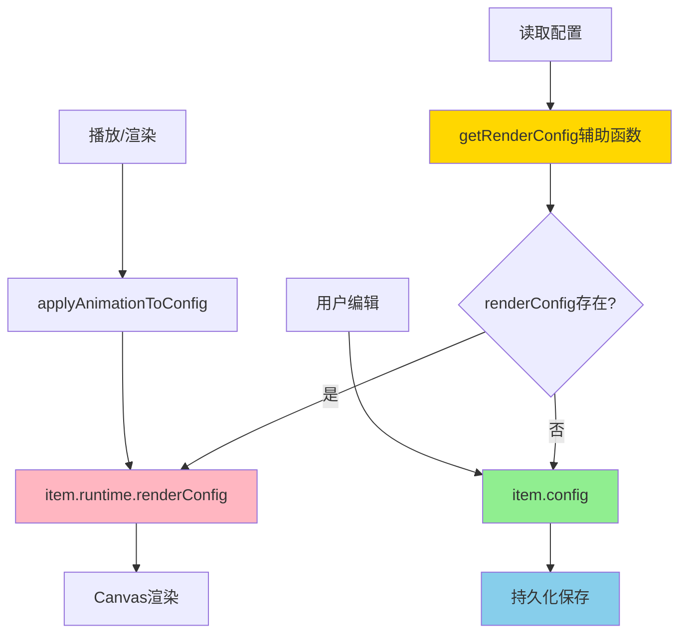

# 动画插值与自动保存冲突解决方案（最终版：可选 + 辅助函数）

## 问题描述

在 LightCut 视频编辑器中，存在一个关键的架构冲突：

### 冲突场景
1. **播放时的动画插值**：[`applyAnimationToConfig()`](LightCut-frontend/src/core/utils/animationInterpolation.ts:106) 在播放时以 30fps 的频率计算关键帧之间的插值，并将结果写入 `item.config`
2. **自动保存监听**：[`UnifiedAutoSaveModule.ts`](LightCut-frontend/src/core/modules/UnifiedAutoSaveModule.ts:322-333) 中的 `timelineItems` watcher 深度监听所有 timeline items 的变化
3. **结果**：每次动画插值修改 `config` 都会触发自动保存，导致频繁的保存操作

### 核心矛盾
- **动画插值**：需要实时修改显示属性（30fps）
- **自动保存**：只应该保存用户的编辑操作，不应该保存临时的动画插值结果

---

## 最终方案：renderConfig 可选 + 辅助函数

### 核心设计决策

经过深入分析和权衡，`renderConfig` 应该保持为**可选字段**，并通过**辅助函数**优雅地访问。

### 为什么可选？

#### 1. 类型安全的矛盾

如果 `renderConfig` 是必选字段：
```typescript
// ❌ 类型错误
clonedItem.runtime = {}  // runtime.renderConfig 是必选的，但这里是空对象
```

如果 `renderConfig` 是可选字段：
```typescript
// ✅ 类型正确
clonedItem.runtime = {}  // 可选字段可以不存在
```

#### 2. 语义正确性

- `renderConfig` 是**运行时数据**，只在运行时需要
- 序列化时不需要，所以可以不存在
- 这符合"可选"的真实语义

#### 3. 性能优化

- 懒加载：只在需要时创建
- 节省内存

### 优雅的解决方案：辅助函数

**问题**：不想到处写 `item.runtime.renderConfig || item.config`

**解决**：通过辅助函数统一访问

```typescript
// TimelineItemQueries.ts 中添加
export function getRenderConfig<T extends MediaType>(
  item: UnifiedTimelineItemData<T>
): GetConfigs<T> {
  return item.runtime.renderConfig || item.config
}

// 使用时
const config = TimelineItemQueries.getRenderConfig(item)
```

**优点**：
- ✅ 统一的访问点
- ✅ 类型安全
- ✅ 易于维护
- ✅ 可以添加日志、调试等逻辑
- ✅ 不需要到处写 `|| config`

---

## 架构设计

### 数据结构

```typescript
export interface UnifiedTimelineItemRuntime<T extends MediaType = MediaType> {
  bunnyClip?: Raw<BunnyClip>
  textBitmap?: ImageBitmap
  renderConfig?: GetConfigs<T>  // ✅ 可选：动画插值后的临时配置
}
```

### 数据流



### 数据流程详解

#### 1. 初始化阶段
```typescript
// 创建 TimelineItem 时
item.config = { x: 100, y: 200, ... }
item.runtime = {}  // renderConfig 不存在（懒加载）
```

#### 2. 首次渲染/动画阶段
```typescript
// applyAnimationToConfig 中懒加载
if (!item.runtime.renderConfig) {
  item.runtime.renderConfig = { ...item.config }  // 首次创建
}
Object.assign(item.runtime.renderConfig, item.config, animatedProps)
```

#### 3. 渲染阶段
```typescript
// 使用辅助函数
const config = TimelineItemQueries.getRenderConfig(item)
renderItem(config, ctx)
```

#### 4. 用户编辑阶段
```typescript
// 用户拖动元素
item.config.x = 300  // 修改原始值
// renderConfig 在下次渲染时自动同步（通过 applyAnimationToConfig）

// 触发自动保存（只保存 config）
autoSave({ contentChanged: true })
```

#### 5. 序列化阶段
```typescript
// 清空 runtime
clonedItem.runtime = {}  // ✅ renderConfig 是可选的，不会报错
```

---

## 详细实施方案

### 1. 添加辅助函数

**文件**：[`LightCut-frontend/src/core/timelineitem/queries.ts`](LightCut-frontend/src/core/timelineitem/queries.ts)

```typescript
/**
 * 获取用于渲染的配置
 * 优先返回 renderConfig（包含动画插值），否则返回 config
 * 
 * @param item 时间轴项目
 * @returns 用于渲染的配置对象
 */
export function getRenderConfig<T extends MediaType>(
  item: UnifiedTimelineItemData<T>
): GetConfigs<T> {
  return item.runtime.renderConfig || item.config
}

// 导出到 TimelineItemQueries
export const TimelineItemQueries = {
  // 类型守卫
  isVideoTimelineItem,
  isImageTimelineItem,
  isAudioTimelineItem,
  isTextTimelineItem,
  hasVisualProperties,
  hasAudioProperties,

  // 状态查询
  isReady,
  isLoading,
  hasError,
  canEdit,
  getStatusText,
  getProgressInfo,
  getErrorInfo,
  
  // 配置访问（新增）
  getRenderConfig,
}
```

### 2. 修改动画插值逻辑

**文件**：[`LightCut-frontend/src/core/utils/animationInterpolation.ts`](LightCut-frontend/src/core/utils/animationInterpolation.ts:106)

**改动位置**：第 152 行

```typescript
export function applyAnimationToConfig(
  item: UnifiedTimelineItemData<MediaType>,
  currentAbsoluteFrame: number
): void {
  // 1. 懒加载：首次使用时初始化 renderConfig
  if (!item.runtime.renderConfig) {
    item.runtime.renderConfig = { ...item.config }
  }
  
  // 2. 检查是否有动画
  if (!item.animation || item.animation.keyframes.length === 0) {
    // 没有动画时，确保 renderConfig 与 config 同步
    Object.assign(item.runtime.renderConfig, item.config)
    return
  }
  
  // 3. 检查是否在时间范围内
  const isInTimeRange =
    currentAbsoluteFrame >= item.timeRange.timelineStartTime &&
    currentAbsoluteFrame <= item.timeRange.timelineEndTime
  if (!isInTimeRange) {
    // 不在范围内，使用原始 config
    Object.assign(item.runtime.renderConfig, item.config)
    return
  }
  
  // 4-6. 计算动画属性（保持不变）
  // ...
  
  // 7. ✅ 应用到 runtime.renderConfig（不触发自动保存）
  Object.assign(item.runtime.renderConfig, item.config, animatedProps)
}
```

**关键改进**：
- 懒加载：只在首次需要时创建 `renderConfig`
- 不修改 `config`，避免触发自动保存

### 3. 修改渲染逻辑

**文件**：[`LightCut-frontend/src/core/bunnyUtils/canvasRenderer.ts`](LightCut-frontend/src/core/bunnyUtils/canvasRenderer.ts:88)

**改动位置**：第 88 行

```typescript
import { TimelineItemQueries } from '@/core/timelineitem/queries'

export function renderItem(
  item: UnifiedTimelineItemData<MediaType>,
  ctx: CanvasRenderingContext2D,
  bunnyCurFrameMap: Map<string, FrameData>,
  getMediaItem: (mediaItemId: string) => UnifiedMediaItemData | undefined,
): void {
  // 检查是否有视觉属性
  if (!TimelineItemQueries.hasVisualProperties(item)) {
    return
  }

  // ✅ 使用辅助函数获取渲染配置
  const visualConfig = TimelineItemQueries.getRenderConfig(item)

  // 渲染逻辑保持不变...
}
```

### 4. 修改属性面板显示

**文件**：[`LightCut-frontend/src/core/composables/useKeyframeTransformControls.ts`](LightCut-frontend/src/core/composables/useKeyframeTransformControls.ts)

**需要修改的计算属性**：
- `transformX`、`transformY`
- `scaleX`、`scaleY`
- `rotation`、`opacity`
- `volume`

**改动示例**（以 `transformX` 为例）：

```typescript
import { TimelineItemQueries } from '@/core/timelineitem/queries'

const transformX = computed(() => {
  if (!selectedTimelineItem.value) return 0
  if (!TimelineItemQueries.hasVisualProperties(selectedTimelineItem.value)) return 0
  
  // ✅ 使用辅助函数
  const config = TimelineItemQueries.getRenderConfig(selectedTimelineItem.value)
  return config.x
})
```

### 5. 修改关键帧创建逻辑

**文件**：[`LightCut-frontend/src/core/utils/unifiedKeyframeUtils.ts`](LightCut-frontend/src/core/utils/unifiedKeyframeUtils.ts:82)

**改动位置**：`createKeyframe()` 函数中读取当前值的地方

**需要修改的场景**：
1. Video 类型（第 93-110 行）
2. Image/Text 类型（第 111-126 行）
3. Audio 类型（第 127-137 行）

**改动示例**（以 Video 类型为例）：

```typescript
import { TimelineItemQueries } from '@/core/timelineitem/queries'

export function createKeyframe(
  item: UnifiedTimelineItemData<MediaType>,
  currentAbsoluteFrame: number,
  propertyName?: string
): AnimateKeyframe<MediaType> | null {
  // ... 前面的代码不变

  if (TimelineItemQueries.isVideoTimelineItem(item)) {
    // ✅ 使用辅助函数获取当前显示的值
    const config = TimelineItemQueries.getRenderConfig(item)
    
    return {
      id: generateId(),
      position: percentage,
      properties: {
        x: config.x,
        y: config.y,
        scaleX: config.scaleX,
        scaleY: config.scaleY,
        rotation: config.rotation,
        opacity: config.opacity,
        volume: config.volume,
      },
    }
  }
  
  // ... 其他类型类似修改
}
```

### 6. 修改播放模块音量读取

**文件**：[`LightCut-frontend/src/core/modules/UnifiedMediaBunnyModule.ts`](LightCut-frontend/src/core/modules/UnifiedMediaBunnyModule.ts)

**改动位置**：第 328-329 行（`updateClips` 方法中）

```typescript
import { TimelineItemQueries } from '@/core/timelineitem/queries'

// 在 updateClips 方法中，读取音量和静音状态时
private updateClips(currentAbsoluteFrame: number): void {
  // ... 前面的代码

  for (const item of this.timelineModule.timelineItems.value) {
    // ... 其他逻辑

    // ✅ 使用辅助函数获取渲染配置（包含动画插值后的音量）
    const config = TimelineItemQueries.getRenderConfig(item)
    const isItemMuted = config.isMuted ?? false
    const itemVolume = config.volume ?? 1.0

    // 应用音量到 BunnyClip
    if (item.runtime.bunnyClip) {
      item.runtime.bunnyClip.setVolume(isItemMuted ? 0 : itemVolume)
    }

    // ... 后续逻辑
  }
}
```

**说明**：
- 这是播放时实时读取音量的关键位置
- 必须使用 `getRenderConfig()` 才能获取动画插值后的音量值
- 否则音量动画在播放时不会生效

### 7. 修改导出逻辑

**文件**：[`LightCut-frontend/src/core/utils/projectExporter.ts`](LightCut-frontend/src/core/utils/projectExporter.ts:261)

**改动位置**：第 261 行

```typescript
import { TimelineItemQueries } from '@/core/timelineitem/queries'

// 在 renderFrameAndCollectAudio 方法中
// 收集音频缓冲（使用 item.id 作为键）
if (shouldRequestAudio && audio && audio.length > 0) {
  // ✅ 使用辅助函数获取当前音量值（应用了动画插值）
  const config = TimelineItemQueries.getRenderConfig(item)
  const currentVolume = config.volume ?? 1.0
  
  audioBuffersMap.set(item.id, {
    buffers: audio,
    volume: currentVolume,
  })
}
```

### 8. 自动保存监听（精确字段）

**文件**：[`LightCut-frontend/src/core/modules/UnifiedAutoSaveModule.ts`](LightCut-frontend/src/core/modules/UnifiedAutoSaveModule.ts:322-333)

**改动位置**：恢复被注释的 `timelineItems` watcher

```typescript
// 监听时间轴项目变化 - 内容变化
// ✅ 使用精确字段监听，只监听需要持久化的字段
const unwatchTimelineItems = watch(
  () => dataWatchers.timelineItems.value?.map(item => ({
    id: item.id,
    mediaItemId: item.mediaItemId,
    trackId: item.trackId,
    timelineStatus: item.timelineStatus,
    mediaType: item.mediaType,
    timeRange: item.timeRange,
    config: item.config,        // ✅ 监听
    animation: item.animation,  // ✅ 监听
    // ❌ 不监听 runtime（包括 runtime.renderConfig）
  })),
  () => {
    console.log('🔍 [AutoSave] timelineItems changed')
    triggerSave()
  },
  { deep: true }
)
```

**说明**：
- 使用 `map()` 创建新对象，只包含需要持久化的字段
- 明确排除 `runtime` 字段（包括 `runtime.renderConfig`）
- 这样动画插值修改 `runtime.renderConfig` 时不会触发自动保存
- 但用户编辑 `config` 或 `animation` 时会正常触发自动保存

### 9. 序列化逻辑（无需修改）

**文件**：[`UnifiedProjectModule.ts`](LightCut-frontend/src/core/modules/UnifiedProjectModule.ts:184-190)

**当前代码**（已经完美）：
```typescript
updatedProjectTimeline = {
  tracks: trackModule.tracks.value,
  timelineItems: timelineModule.timelineItems.value.map((item) => {
    const clonedItem = TimelineItemFactory.clone(item)
    if (clonedItem.runtime) {
      clonedItem.runtime = {}  // ✅ 清空 runtime，renderConfig 是可选的，不会报错
    }
    return clonedItem
  }),
}
```

**说明**：
- ✅ 通过 `clonedItem.runtime = {}` 清空整个 `runtime` 对象
- ✅ `runtime.renderConfig` 不会被保存
- ✅ 只有 `config` 会被保存
- ✅ 不需要创建新的序列化类型

---

## 核心优势

### 1. 类型安全
- ✅ 序列化时 `runtime = {}` 不会报错
- ✅ TypeScript 类型检查通过

### 2. 代码优雅
- ✅ 通过 `getRenderConfig()` 统一访问
- ✅ 不需要到处写 `|| config`
- ✅ 易于维护和扩展

### 3. 性能优化
- ✅ 懒加载：只在需要时创建
- ✅ 节省内存
- ✅ 精确字段监听

### 4. 防御性编程
- ✅ 自动回退到 `config`
- ✅ 容错性强

### 5. 可扩展性
- ✅ 可以在辅助函数中添加日志
- ✅ 可以添加开发模式的检查
- ✅ 统一的访问点便于未来优化

---

## 实施步骤

### 步骤1：添加辅助函数
- [ ] 在 `TimelineItemQueries.ts` 中添加 `getRenderConfig()` 函数
- [ ] 导出到 `TimelineItemQueries` 对象

### 步骤2：修改动画插值逻辑
- [ ] 修改 `applyAnimationToConfig()`，添加懒加载逻辑
- [ ] 改为修改 `runtime.renderConfig` 而不是 `config`

### 步骤3：修改渲染逻辑
- [ ] 修改 `renderItem()`，使用 `getRenderConfig()` 辅助函数
- [ ] 检查 `isInBounds` 等其他渲染相关代码

### 步骤4：修改属性面板显示
- [ ] 修改 `useKeyframeTransformControls.ts` 中的所有计算属性
- [ ] 使用 `getRenderConfig()` 辅助函数
- [ ] 需要修改的属性：`transformX`、`transformY`、`scaleX`、`scaleY`、`rotation`、`opacity`、`volume`

### 步骤5：修改关键帧创建逻辑
- [ ] 修改 `createKeyframe()` 函数
- [ ] 使用 `getRenderConfig()` 辅助函数获取当前值
- [ ] 确保在播放过程中创建关键帧时，使用动画插值后的实时值

### 步骤6：修改播放模块音量读取
- [ ] 修改 `UnifiedMediaBunnyModule.ts` 第328-329行
- [ ] 使用 `getRenderConfig()` 辅助函数读取音量和静音状态
- [ ] 确保播放时音量动画正确应用

### 步骤7：修改导出逻辑
- [ ] 修改 `projectExporter.ts` 第261行
- [ ] 使用 `getRenderConfig()` 辅助函数读取音量值

### 步骤8：恢复自动保存监听
- [ ] 恢复 `timelineItems` 监听器
- [ ] 使用精确字段监听，排除 `runtime` 字段

### 步骤9：测试验证
- [ ] 测试无动画场景
- [ ] 测试有动画场景
- [ ] 测试自动保存触发
- [ ] 测试关键帧创建
- [ ] 测试序列化和反序列化

---

## 核心改动点总结

### 10个核心修改点

1. **辅助函数**：[`TimelineItemQueries.getRenderConfig()`](LightCut-frontend/src/core/timelineitem/queries.ts) - 统一的配置访问点
2. **动画插值**：[`applyAnimationToConfig()`](LightCut-frontend/src/core/utils/animationInterpolation.ts:106) - 懒加载 + 修改 `runtime.renderConfig`
3. **渲染逻辑**：[`renderItem()`](LightCut-frontend/src/core/bunnyUtils/canvasRenderer.ts:88) - 使用 `getRenderConfig()`
4. **属性显示**：[`useKeyframeTransformControls.ts`](LightCut-frontend/src/core/composables/useKeyframeTransformControls.ts) - 使用 `getRenderConfig()`
5. **关键帧创建**：[`createKeyframe()`](LightCut-frontend/src/core/utils/unifiedKeyframeUtils.ts:82) - 使用 `getRenderConfig()`
6. **播放音量**：[`UnifiedMediaBunnyModule.ts`](LightCut-frontend/src/core/modules/UnifiedMediaBunnyModule.ts:328-329) - 使用 `getRenderConfig()` 读取音量和静音状态
7. **导出音量**：[`projectExporter.ts`](LightCut-frontend/src/core/utils/projectExporter.ts:261) - 使用 `getRenderConfig()`
8. **自动保存监听**：[`UnifiedAutoSaveModule.ts`](LightCut-frontend/src/core/modules/UnifiedAutoSaveModule.ts) - 精确字段监听，排除 `runtime`
9. **序列化**：[`UnifiedProjectModule.ts`](LightCut-frontend/src/core/modules/UnifiedProjectModule.ts:184-190) - 无需修改（已完美）
10. **类型定义**：[`UnifiedTimelineItemRuntime`](LightCut-frontend/src/core/timelineitem/type.ts:68) - 保持 `renderConfig?` 可选

### 保持不变

- ✅ 用户编辑逻辑（[`handlePropertyChange()`](LightCut-frontend/src/core/utils/unifiedKeyframeUtils.ts:539) 智能处理）
- ✅ 关键帧系统（创建/更新/删除关键帧）
- ✅ 命令系统（历史记录和撤销重做）

---

## 代码示例对比

### 改动前（不优雅）
```typescript
// 到处都要写回退逻辑
const config1 = item.runtime.renderConfig || item.config
const config2 = item.runtime.renderConfig || item.config
const config3 = item.runtime.renderConfig || item.config
```

### 改动后（优雅）
```typescript
// 统一使用辅助函数
const config1 = TimelineItemQueries.getRenderConfig(item)
const config2 = TimelineItemQueries.getRenderConfig(item)
const config3 = TimelineItemQueries.getRenderConfig(item)
```

---

## 测试计划

### 1. 辅助函数测试
**目标**：验证 `getRenderConfig()` 正确工作

**测试步骤**：
1. 创建一个新的视频项目
2. 添加视频到时间轴
3. 检查 `getRenderConfig()` 返回值
4. 添加动画并播放
5. 再次检查 `getRenderConfig()` 返回值

**预期结果**：
- ✅ 无动画时返回 `config`
- ✅ 有动画时返回 `renderConfig`（包含插值）

### 2. 无动画场景测试
**目标**：验证没有动画时的正常工作

**测试步骤**：
1. 创建一个新的视频项目
2. 添加视频/图片/文本到时间轴
3. 不添加任何关键帧
4. 播放并观察渲染效果
5. 修改属性（位置、缩放、旋转等）
6. 验证自动保存是否正常触发

**预期结果**：
- ✅ 渲染正常（使用 `config`）
- ✅ 属性面板显示正确（使用 `config`）
- ✅ 修改属性后自动保存正常触发
- ✅ 保存的数据中 `runtime` 为空对象

### 3. 有动画场景测试
**目标**：验证动画插值和自动保存的隔离

**测试步骤**：
1. 创建一个新的视频项目
2. 添加视频到时间轴
3. 在不同位置创建多个关键帧（例如位置动画）
4. 播放并观察：
   - 动画是否流畅
   - 属性面板是否显示实时插值后的值
   - 控制台是否频繁输出自动保存日志
5. 在播放过程中暂停，修改属性
6. 验证自动保存是否正常触发

**预期结果**：
- ✅ 动画播放流畅
- ✅ 属性面板显示实时插值值（使用 `renderConfig`）
- ✅ 播放时不触发自动保存（`renderConfig` 变化不被监听）
- ✅ 修改属性后自动保存正常触发（`config` 变化被监听）
- ✅ 保存的数据中只有 `config` 和 `animation`，没有 `renderConfig`

### 4. 关键帧创建测试
**目标**：验证在播放过程中创建关键帧的正确性

**测试步骤**：
1. 创建一个新的视频项目
2. 添加视频到时间轴
3. 创建两个关键帧（例如 x=0 和 x=100）
4. 播放到中间位置（例如 x=50）
5. 点击创建关键帧按钮
6. 检查新创建的关键帧的值

**预期结果**：
- ✅ 新创建的关键帧使用当前插值后的值（x=50）
- ✅ 而不是原始 `config` 的值
- ✅ 这样用户看到的值和保存的关键帧值一致

### 5. 播放音量动画测试
**目标**：验证播放时音量动画正确应用

**测试步骤**：
1. 创建一个新的视频项目
2. 添加视频到时间轴
3. 创建音量动画（例如从 1.0 到 0.0）
4. 播放项目
5. 观察音量变化是否平滑

**预期结果**：
- ✅ 播放时音量从 1.0 平滑过渡到 0.0
- ✅ 音量动画实时生效
- ✅ 静音状态正确应用

### 6. 导出测试
**目标**：验证导出时正确应用音量动画

**测试步骤**：
1. 创建一个新的视频项目
2. 添加视频到时间轴
3. 创建音量动画（例如从 1.0 到 0.0）
4. 导出项目
5. 播放导出的视频，检查音量变化

**预期结果**：
- ✅ 导出的视频正确应用了音量动画
- ✅ 音量从 1.0 平滑过渡到 0.0

### 7. 序列化测试
**目标**：验证保存和加载的正确性

**测试步骤**：
1. 创建一个新的视频项目
2. 添加视频并创建动画
3. 播放一段时间（让 `renderConfig` 被创建）
4. 保存项目
5. 检查保存的 JSON 文件
6. 重新加载项目
7. 验证项目状态

**预期结果**：
- ✅ 保存的 JSON 中 `runtime` 为空对象 `{}`
- ✅ 没有 `renderConfig` 字段
- ✅ 重新加载后项目正常工作
- ✅ 播放时 `renderConfig` 会被懒加载创建

---

## 总结

这个方案完美解决了所有问题：

1. ✅ **类型安全**：序列化时 `runtime = {}` 不会报错
2. ✅ **代码优雅**：通过 `getRenderConfig()` 统一访问，不需要到处写 `|| config`
3. ✅ **性能优化**：懒加载 + 精确字段监听
4. ✅ **易于维护**：统一的访问点
5. ✅ **向后兼容**：保存格式不变
6. ✅ **彻底隔离**：动画插值和持久化数据完全分离
7. ✅ **解决冲突**：自动保存不再被动画触发

**最关键的是**：通过辅助函数 `TimelineItemQueries.getRenderConfig(item)` 优雅地解决了"到处写 `|| config`"的问题！